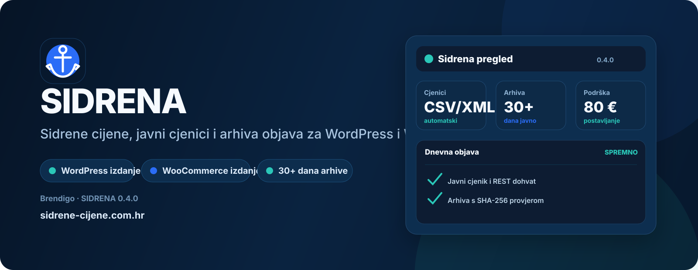
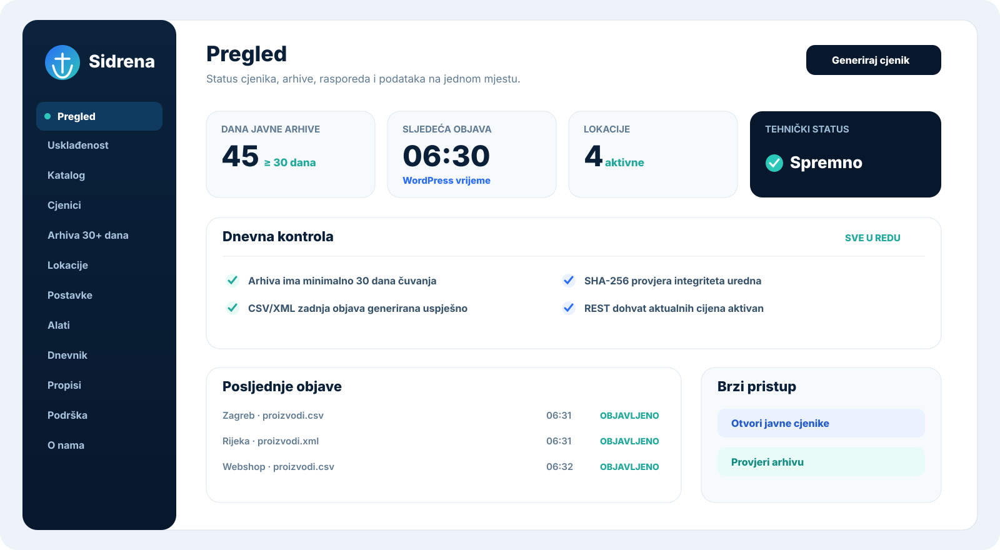
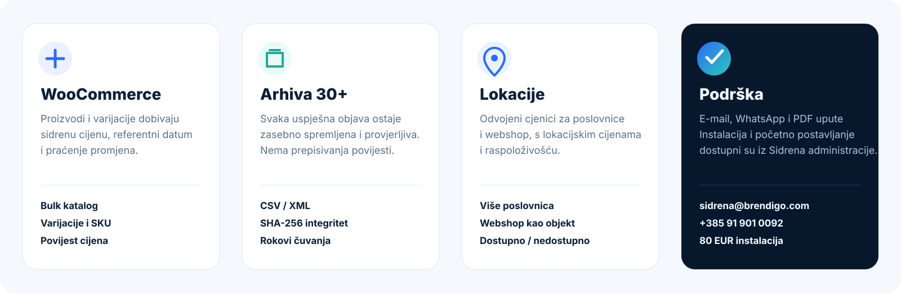
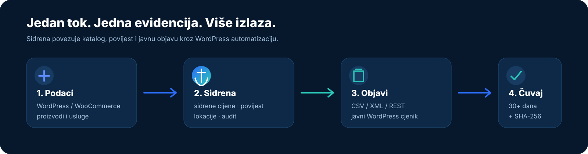

<!--
Sidrena source file.
Author: Brendigo
Author URI: https://brendigo.com/
Plugin URI: https://sidrene-cijene.com.hr/
Support: sidrena@brendigo.com
-->

<p align="center">
  
</p>

<p align="center">
  <strong>Produkcijski WordPress/WooCommerce dodatak za sidrene cijene, javne cjenike i 30+ dana arhive objava.</strong><br>
  Brendigo · Sidrena plugin distribution
</p>

<p align="center">
  ⚓ Sidrena WordPress · 🛒 Sidrena WooCommerce · 🌐 Objava cjenika · 🛡 Compliance guard · 🛟 Brendigo podrška
</p>



# Sidrena

Sidrena je Brendigo dodatak za trgovce, web shopove i WordPress stranice koje moraju jasno voditi **sidrene/referentne cijene**, javno objavljivati CSV/XML cjenike i zadržati javnu arhivu prethodnih objava najmanje 30 dana.

Projekt se distribuira isključivo kao dva odvojena WordPress plugin ZIP paketa:

| Izdanje | Namjena | Izvor proizvoda |
|---|---|---|
| ⚓ **Sidrena WordPress** | WordPress bez WooCommercea | Sidrena katalog ili povezani postojeći WordPress sadržaj |
| 🛒 **Sidrena WooCommerce** | WordPress + WooCommerce | postojeći WooCommerce proizvodi i varijacije |

> **Važno:** dva Sidrena WordPress/WooCommerce izdanja ne smiju biti aktivna istodobno. Plugin ima ugrađenu zaštitu od konflikta.

## Zašto Sidrena

- **Jedan jasan sustav cijena** — sidrena cijena, aktualna cijena, jedinična cijena, referentni datum i lokacija/webshop.
- **Javna objava bez ručnog rada** — CSV/XML datoteke, pretraživi HTML cjenik i arhiva objava.
- **Veliki katalozi bez pucanja memorije** — streaming snapshot, server-side pretraga i paginacija.
- **Produkcijska zaštita** — CI, distribution guard, legal automation guard i admin polish guard čuvaju release liniju.
- **Brendigo podrška** — ugrađen PDF, e-mail i WhatsApp kontakt bez vanjskog slanja poslovnih podataka.

## ✨ Glavne mogućnosti

- ⚓ sidrena/referentna cijena i datum
- 🧾 aktualna i primjenjiva jedinična cijena
- 📦 CSV/XML javni cjenici
- 🌐 javna stranica **Objava cjenika**
- 🔎 pretraživi HTML cjenik
- 🗂 arhiva prethodnih objava 30+ dana, grupirana po datumu
- 🔄 REST/automatizirani pristup s ograničenom paginacijom; Woo varijacije broje se kao stvarne javne stavke
- 🏬 više lokacija i webshop kao zaseban objekt
- ⏰ dnevno automatsko generiranje, zadano u 06:30
- 🧯 sigurnosna provjera propuštene dnevne objave
- 🛡 compliance watchdog koji automatski obnavlja sigurne tehničke postavke, cronove, javnu stranicu i upload zaštitu
- 🧾 lokalni audit log s produkcijskim limitima, pruningom i throttlingom ponavljajućih zapisa
- ✉️ ograničena e-mail upozorenja kod neuspjele/zakašnjele objave
- 🏢 opcionalni javni podaci obrta/tvrtke s OIB provjerom
- 🧼 neutralan WordPress admin menu bez dodatne custom SVG ikonice u bočnom meniju
- 🛟 ugrađena PDF, e-mail i WhatsApp podrška



## ⚓ Sidrena WordPress

Sidrena WordPress može povezati postojeći javni WordPress tip sadržaja s vlastitim katalogom.

1. Otvorite **Sidrena → Katalog**.
2. Odaberite tip sadržaja koji predstavlja postojeće proizvode.
3. Po potrebi unesite meta ključ postojeće cijene.
4. Pokrenite sinkronizaciju.
5. Dopunite sidrenu cijenu i podatke koji nedostaju.

Sinkronizacija se obrađuje u batchovima od 100 zapisa. Nakon povezivanja Sidrena prati promjene izvornog naziva i prepoznate cijene.

Na povezanoj javnoj stranici Sidrena automatski dodaje sidrenu cijenu. Shortcode `[sidrena_cijena]` ostaje dostupan za posebne rasporede.

## 🛒 Sidrena WooCommerce

WooCommerce ostaje jedini katalog proizvoda — nema dupliciranja.

1. Otvorite postojeći WooCommerce proizvod ili varijaciju.
2. Unesite sidrenu cijenu i referentne podatke.
3. Spremite proizvod.
4. Sidrena automatski prikazuje sidrenu cijenu uz WooCommerce cijenu.

Compatibility layer pokriva standardni WooCommerce prikaz cijene, varijacije, WooCommerce blokove i više popularnih buildera.



## 🌐 Objava cjenika

Kompletna javna stranica koristi shortcode:

```text
[sidrena_objava_cjenika]
```

Prikaz može uključiti podatke obrta/tvrtke, aktualni pretraživi cjenik, datoteke za preuzimanje i arhivu. Javni cjenik koristi streaming snapshot, server-side pretragu cijelog kataloga i paginaciju, pa velika baza ne mora biti učitana odjednom u PHP memoriju ili DOM.

Dostupni su i zasebni prikazi:

```text
[sidrena_cjenici]
[sidrena_cjenik]
[sidrena_arhiva]
[sidrena_cijena]
[sidrena_usluge]
```

## 🧰 Usluge i uvoz

`[sidrena_usluge]` koristi server-side paginaciju od 10 do 100 stavki, zadano 50. Admin compliance audit usluge obrađuje u batchovima od 250 umjesto učitavanja cijelog kataloga.

WordPress katalog obrađuje CSV retke streaming pristupom. XML koristi `XMLReader` kada je dostupan, uz NONET i zabranu DOCTYPE/ENTITY deklaracija. CSV/XML import ograničen je na 50.000 zapisa po datoteci, a limit se provjerava prije poslovnih promjena.

## ⏰ Automatizirana dnevna objava

Zadano vrijeme generiranja je **06:30**. Ako je planirano vrijeme prošlo, a današnja objava nije evidentirana, sigurnosna provjera stavlja novu generaciju u red.

Compliance watchdog provjerava i obnavlja CSV/XML/javni HTML, strict publication, failure notifications, dnevni generation cron, hourly publication watch, javnu Sidrena stranicu i upload direktorije kada je to sigurno moguće. Audit log ima ograničenja veličine i automatsko čišćenje kako ne bi rastao bez kontrole.



## Produkcijska kvaliteta

Sidrena release linija čuva se automatiziranim provjerama:

- PHP 7.4, 8.3 i 8.4 syntax/runtime smoke testovi
- odvojena WordPress i WooCommerce runtime provjera
- konflikt guard za dva izdanja
- streaming public snapshot, transactional generation i archive smoke testovi
- distribution guard koji dopušta samo dva plugin ZIP-a
- legal automation guard za referentne datume, cronove i objave
- admin polish guard za neutralan WordPress menu i čistu release granu

## 🛟 Podrška

| Kanal | Podatak |
|---|---|
| 📧 E-mail | **sidrena@brendigo.com** |
| 💬 WhatsApp | **+385 91 901 0092** |
| 🧰 Opcionalno jednokratno postavljanje | **80 EUR jednokratno**, samo ako želite da Brendigo sve postavi |
| ❤️ Donacija za razvoj | dobrovoljna, izravno preko Revoluta; nije naknada za uslugu |
| 👤 Autor | **Brendigo** |

PDF podrška uključena je u oba ZIP-a kao `docs/SIDRENA-PODRSKA.pdf`.

## 📥 Službeni release asseti

Službeni GitHub release smije sadržavati samo dva plugin ZIP asseta:

- `sidrena-wordpress-<verzija>.zip`
- `sidrena-woocommerce-<verzija>.zip`

`portable.exe`, `setup.exe`, desktop aplikacije i dodatni generički paketi nisu dio Sidrena distribucije.

## 🔐 Licenca

Sidrena nije open-source projekt.

Korištenje je dopušteno prema **Sidrena Software License 1.0**. Nije dopušteno prodavati, preprodavati, sublicencirati, redistribuirati, white-labelati ili rebrandirati Sidrenu bez pisanog odobrenja Brendigo.

Puni tekst: [LICENSE](LICENSE)

## ⚖️ Tehnička podrška propisima

Sidrena tehnički prati provjerene zahtjeve iz NN 101/2026 (dodatna cijena i objava cjenika), NN 105/2026 (maloprodajna/jedinična cijena i usluge) te službenih pojašnjenja Ministarstva gospodarstva od 22.09.2026.

Plugin podržava obvezni skup podataka, CSV/XML objavu, zasebne lokacije/webshop, najmanje 30 dana javne arhive, referentne datume i automatizirani dohvat aktualnih cijena. Referentne i povijesne cijene moraju odgovarati stvarnoj poslovnoj evidenciji korisnika.

Softver **ne predstavlja automatsku pravnu potvrdu konkretnog poslovanja**; primjenjivost obveza ovisi o stvarnim proizvodima/uslugama, poslovnom modelu i podacima koje korisnik unese.

## 🧪 Razvoj i provjera

```bash
./tools/build-editions.sh 0.8.0 /tmp/sidrena-build
```

## Brendigo

Službena stranica: https://sidrene-cijene.com.hr/  
Podrška: sidrena@brendigo.com
