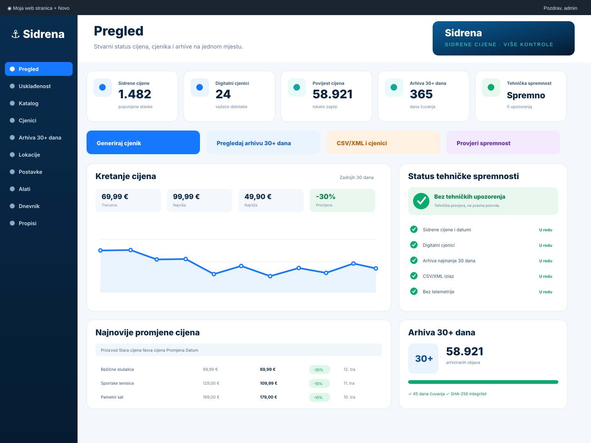
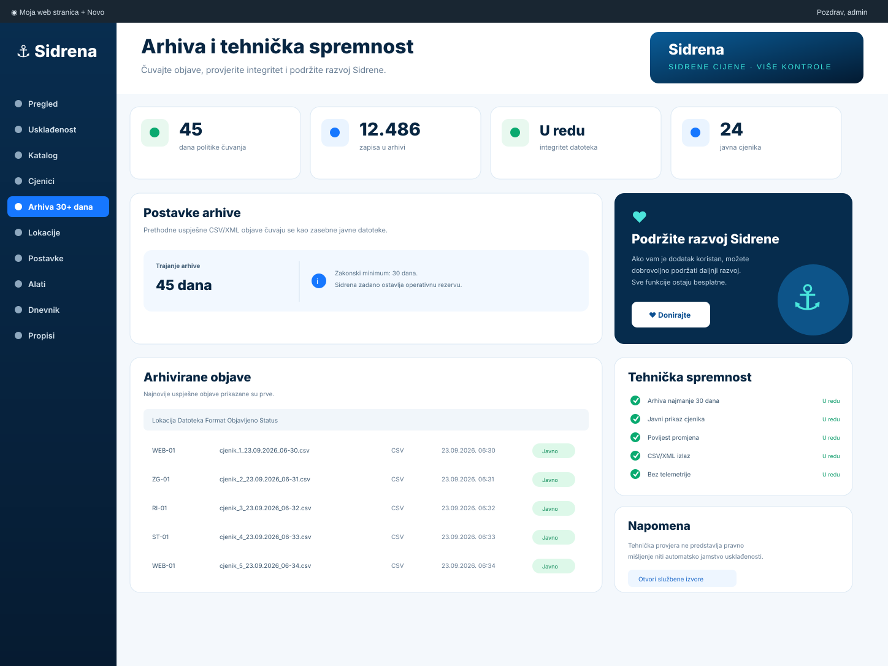
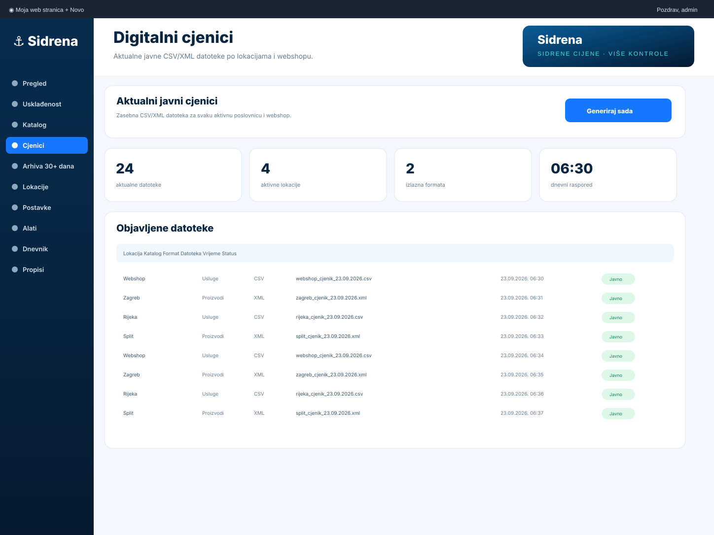
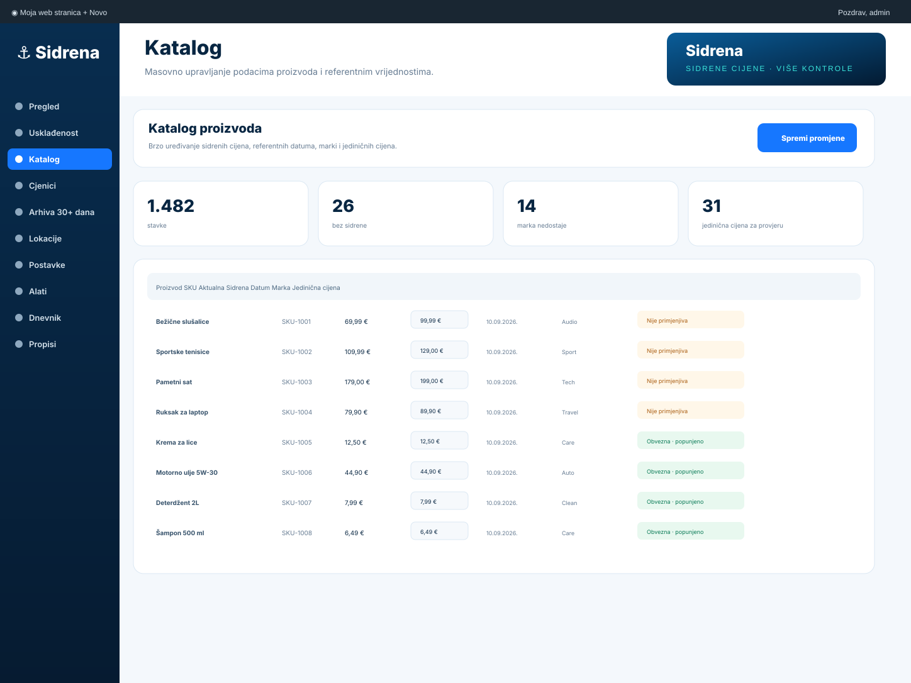
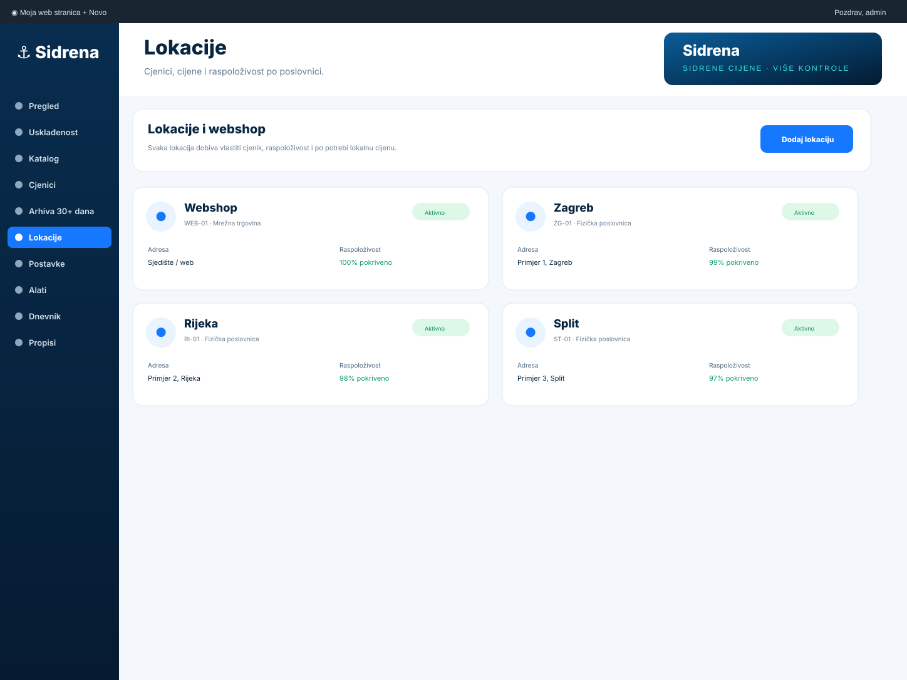
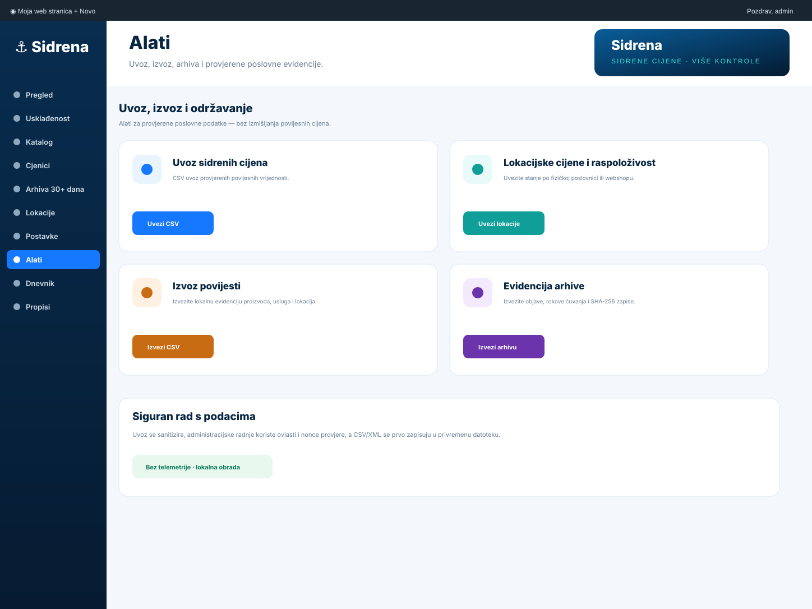

  
  
<strong>Sidrene cijene, povijest cijena, javni CSV/XML cjenici i arhiva 30+ dana za WordPress i WooCommerce.</strong>

  

    <a href="https://sidrene-cijene.com.hr/">sidrene-cijene.com.hr</a> ·
    <a href="https://brendigo.com/">Brendigo</a> ·
    <a href="https://sidrene-cijene.com.hr/#donirajte">Podržite razvoj</a>
  

## Sidrene cijene pod kontrolom

**Sidrena 1.6.2** je potpuno besplatan WordPress dodatak za hrvatske trgovce, webshopove, obrtnike i pružatelje usluga. Objedinjuje sidrene/dodatne cijene, povijest cijena, digitalne cjenike, lokacije, javnu arhivu i tehničke provjere u jednom modernom administracijskom sučelju.

**Bez Pro verzije. Bez licencnog ključa. Bez pretplate. Bez telemetrije. Bez obaveznog clouda.**

| WordPress | WooCommerce | PHP | Licenca | Privatnost |
| --- | --- | --- | --- | --- |
| 6.6+ | 8.0+ za proizvode | 7.4+ | GPLv2+ | Bez telemetrije |

> Sidrena automatizira tehničku evidenciju, prikaz i objavu podataka. Ne predstavlja pravno mišljenje niti automatsko jamstvo usklađenosti pojedinog poslovnog subjekta.

## Novo produkcijsko sučelje

Sidrena je samostalni **top-level WordPress izbornik**. Pregled prikazuje stvarne podatke iz WordPressa: broj popunjenih sidrenih cijena, aktualne digitalne cjenike, lokalnu povijest, javnu arhivu, tehnička upozorenja, kretanje cijene i najnovije zabilježene promjene.

Sučelje koristi zasebne stranice **Pregled, Usklađenost, Katalog, Cjenici, Arhiva 30+ dana, Lokacije, Postavke, Alati, Dnevnik i Propisi** — bez duplih horizontalnih menija i bez skrivenih postavki unutar WooCommercea.

## Arhiva 30+ dana i dobrovoljna podrška

Svaka uspješna CSV/XML objava pohranjuje se kao zasebna javna datoteka. Programska postavka čuvanja ne može biti kraća od 30 dana; zadana vrijednost je 45 dana. Arhivski zapis može sadržavati vrijeme objave, rok čuvanja, broj redaka, veličinu i SHA-256 sažetak.

U samom Sidrena panelu postoji diskretan **“Podržite razvoj Sidrene”** blok. Donacija je potpuno dobrovoljna i ne otključava nikakvu funkciju — dodatak ostaje besplatan.

## Ključne mogućnosti

- **WooCommerce proizvodi i varijacije** — sidrena cijena, referentni datum, marka, šifra, jedinična cijena, posebni oblik prodaje i povijest.
- **Katalog usluga bez WooCommercea** — aktualna i sidrena cijena, vrsta, opseg, pripadajući troškovi te ugradbena/zamjenska roba kada je primjenjivo.
- **CSV/XML po lokaciji** — svaka fizička poslovnica i webshop mogu imati zasebnu datoteku.
- **Stvarna raspoloživost po lokaciji** — dostupno / nedostupno uz lokalne cijene.
- **Javna arhiva 30+ dana** — prethodne uspješne objave ne prepisuju se.
- **Povijest cijena** — odvojena od javne arhive i koristi se kao tehnička podloga za 30-dnevnu referencu kod sniženja.
- **Automatska dnevna objava** — zadano 06:30 prema WordPress vremenskoj zoni.
- **REST dohvat** — javni indeks cjenika i aktualne cijene u strojno čitljivom obliku.
- **SHA-256 integritet** — provjera arhiviranih datoteka.
- **Bulk katalog, Site Health, audit dnevnik i WP-CLI** — alati za ozbiljnije produkcijske instalacije.
- **Sve lokalno** — nema udaljene aktivacije, telemetrije ni vanjskog runtime koda.

## Kompatibilnost prikaza cijene

Sidrena koristi standardni WooCommerce `woocommerce_get_price_html` filter, WooCommerce block rendering, builder-specific filtre i lokalni JS fallback za dinamičke price widgete. Time pokriva tipične prikaze cijene u Elementor/JetWooBuilder/ShopEngine, Divi, Oxygen, Bricks, Beaver Builder, Breakdance, Brizy, Avada/Fusion, Woodmart/Flatsome, WPBakery i WooCommerce Blocks.

Za potpuno custom predloške dostupni su:

- `[sidrena-cijena id="123"]`
- `[sidrena_cijena id="123"]`
- `do_action( 'sidrena_cijena' )`
- `sidrena_cijena( 123 )`

## WP-CLI za velike kataloge

- `wp sidrena fill --dry-run` — samo izračuna koliko bi praznih Sidrena cijena bilo popunjeno.
- `wp sidrena fill` — kopira WooCommerce redovnu cijenu samo u prazna Sidrena polja.
- `wp sidrena fill --today` — isto, uz današnji prilagođeni referentni datum kada ga proizvod nema.
- `wp sidrena generate`, `wp sidrena status` i `wp sidrena audit` ostaju dostupni za produkcijsku automatizaciju i dijagnostiku.

Postojeće Sidrena cijene se ovim postupkom ne prepisuju.

## Jedinična cijena — NN 105/2026

Sidrena 1.6 dodaje eksplicitnu provjeru primjenjivosti cijene za jedinicu mjere. Administrator može označiti da je jedinična cijena obvezna, nije primjenjiva, obuhvaćena propisanom iznimkom ili još zahtijeva provjeru.

Ako je označena kao obvezna, tehnička provjera upozorava kada nedostaje jedinica mjere ili iznos. Plugin namjerno ne zaključuje automatski pravni status proizvoda samo na temelju WooCommerce kategorije.

## Usluge

Za usluge se mogu evidentirati naziv, vrsta i opseg, cijena, sidrena cijena, posebni oblik prodaje, pripadajući troškovi i — kada je roba sastavni dio usluge — podatak o ugradbenoj ili zamjenskoj robi i njezinoj cijeni.

## Galerija sučelja

### Katalog i masovno uređivanje

Katalog je namijenjen radu nad većim brojem WooCommerce stavki. Na jednom mjestu možete pregledati i uređivati šifru, marku, barkod, sidrenu cijenu, referentni datum, referentnu skupinu te status i vrijednost jedinične cijene.

### Poslovnice i webshop

Fizičke poslovnice i webshop vode se odvojeno kako bi javni cjenici, lokalne cijene i raspoloživost odgovarali stvarnom prodajnom mjestu.

### Produkcijski alati

Uvoz i izvoz namijenjeni su provjerenim poslovnim podacima. Sidrena ne popunjava povijest izmišljenim vrijednostima i ne pokušava rekonstruirati razdoblje prije instalacije bez vjerodostojnog izvora.

## Vizualni identitet

  

  

Sidrena koristi vlastiti lokalni vizualni sustav: tamnoplavu bazu, Sidrena plavu i jadransku tirkiznu, originalni znak slova **S** sa sidrom te vlastite lokalne administracijske i WordPress.org vizuale. Plugin u radu ne učitava branding s vanjskog CDN-a.

## Produkcijske mogućnosti uvedene u 1.6.1

Sidrena 1.6.1 proširuje sustav iz administracijskog dodatka u kompletan produkcijski cjenik:

- **WooCommerce ili obični WordPress** — kada WooCommerce nije aktivan, Sidrena ima vlastiti katalog proizvoda s nazivom, šifrom, markom, cijenom, sidrenom cijenom, barkodom, jediničnom cijenom, raspoloživošću i podacima o posebnom obliku prodaje.
- **Dodatne stavke uz WooCommerce** — ručno vođeni proizvodi/usluge koje nisu Woo artikli mogu se voditi u Sidreni, ulaze na kraj javnog cjenika i imaju vlastiti shortcode oblika `[sidrena_cijena id="s123"]`.
- **CSV/XML uvoz samostalnog kataloga** — postojeće stavke povezuju se po šifri, a validne nove stavke mogu se dodati iz datoteke.
- **WooCommerce native Import/Export** — Sidrena polja pojavljuju se u standardnom WooCommerce CSV uvozu i izvozu.
- **Javni HTML cjenik** — /sidrena-cjenik/ i shortcodeovi [sidrena_cjenik] / [sidrena-cjenik].
- **Javna arhiva** — /arhiva-sidrene-cijene/ i [sidrena_arhiva] / [sidrena-arhiva].
- **Cache/snapshot model** — javna HTML tablica čita spremljeni snapshot iz zadnjeg uspješnog generiranja i ne prolazi cijeli katalog pri svakom javnom zahtjevu.
- **503 + pozadinska obnova** — ako snapshot ne postoji, javna ruta ne pokušava graditi kompletan katalog u zahtjevu nego zakazuje jednu obnovu s cooldownom.
- **Stroga provjera prije objave** — nepotpun novi cjenik ne zamjenjuje zadnju valjanu objavu.
- **Za fizičke poslovnice** stroga provjera zahtijeva eksplicitno unesenu lokacijsku raspoloživost, umjesto oslanjanja samo na globalni WooCommerce stock.
- **Cron health** — admin upozorava kada je zadnji uspješni cjenik stariji od 26 sati i objašnjava kada je potreban pravi server cron.
- **UTF-8 normalizacija** — CSV uvoz čuva hrvatske znakove i pokušava pretvoriti Windows-1250 / ISO-8859-2.
- **CSV formula-injection zaštita** — javni CSV neutralizira opasne spreadsheet prefikse u tekstualnim vrijednostima.
- **Builder kompatibilnost** — WooCommerce Blocks, Elementor, WPBakery, Oxygen, Divi, Bricks, Beaver Builder i česti Woo builder/theme price wrapperi imaju fallback prikaz Sidrena referentnih cijena.
- **Varijacije** — fallback prati trenutno odabranu WooCommerce varijaciju i ne vraća roditeljsku vrijednost nakon dinamičkog DOM osvježavanja.
- **WPML/Polylang** — korisnički tekst oznake i tooltipa registrira se za prijevod; standardne Sidrena poruke ostaju gettext prevodive.
- **Pristupačan tooltip** — opcionalno objašnjenje sidrene cijene radi na hover i keyboard focus, uz prefers-reduced-motion.
- **Privatnost** — sve ostaje lokalno; nema telemetrije, licencnog poslužitelja, obaveznog clouda ni Pro paywalla.

## Javni REST i shortcodeovi

REST:
- /wp-json/sidrena/v1/cjenici
- /wp-json/sidrena/v1/cijene

Shortcodeovi:
- [sidrena_cjenici]
- [sidrena_usluge]
- [sidrena_cijena]

WP-CLI:
- wp sidrena generate
- wp sidrena status
- wp sidrena audit

## Službeni propisi koje projekt tehnički prati

- **NN 101/2026, 1212** — dodatna/sidrena cijena; primjena od 1. listopada 2026.
- **NN 101/2026, 1213** — javni CSV/XML cjenici, rokovi ažuriranja, 30-dnevna javna dostupnost i strojni dohvat; primjena od 1. listopada 2026.
- **Ministarstvo gospodarstva, 22.09.2026.** — službena pojašnjenja primjene dodatne cijene i objave cjenika.
- **NN 59/2026** — relevantne izmjene Zakona o zaštiti potrošača, uključujući 30-dnevnu referencu kod sniženja.
- **NN 105/2026** — način isticanja maloprodajne/jedinične cijene i pravila za cjenike usluga; objavljen 18.09.2026., stupa na snagu osmoga dana od objave.

Službeni linkovi i informativni sažeci nalaze se u **Sidrena → Propisi**.

## Instalacija

1. U WordPressu otvorite **Dodaci → Dodaj novi → Prenesi dodatak**.
2. Instalirajte aktualni sidrena-x.y.z.zip.
3. Aktivirajte dodatak i otvorite glavni izbornik **Sidrena**.
4. Odaberite način rada: proizvodi, usluge ili kombinirano.
5. Dodajte poslovnice i zaseban webshop.
6. Provjerite sidrene cijene, referentne datume, marke i primjenjivost jedinične cijene.
7. Za fizičke poslovnice unesite ili uvezite stvarnu raspoloživost.
8. Generirajte prvi cjenik i provjerite **Cjenici**, **Arhiva 30+ dana** i **Usklađenost**.
9. Za poslovno kritičan termin koristite pouzdani server cron koji redovito pokreće WordPress cron ili odgovarajuću WP-CLI naredbu.

## Sigurnost i privatnost

Administracijske radnje koriste WordPress ovlasti i nonce provjere. Uvozi se sanitiziraju, a CSV/XML se zapisuju preko privremene datoteke prije konačne zamjene. Sidrena ne šalje telemetriju i ne zahtijeva korisnički račun, licencni server ili vanjski SaaS.

## Podržite Sidrenu

Ako vam Sidrena štedi vrijeme, možete dobrovoljno podržati održavanje, testiranje i daljnji razvoj:

**https://sidrene-cijene.com.hr/#donirajte**

Donacija nije uvjet za korištenje i ne otključava dodatne funkcije.

## Autor

**Brendigo** — https://brendigo.com/  
**Sidrena** — https://sidrene-cijene.com.hr/

## Licenca

GPLv2 or later. Pogledajte [LICENSE](LICENSE).

  
  
<strong>Sidrena — sidrene cijene. Više kontrole.</strong>

