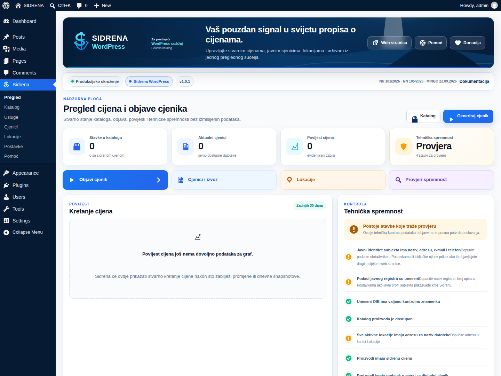
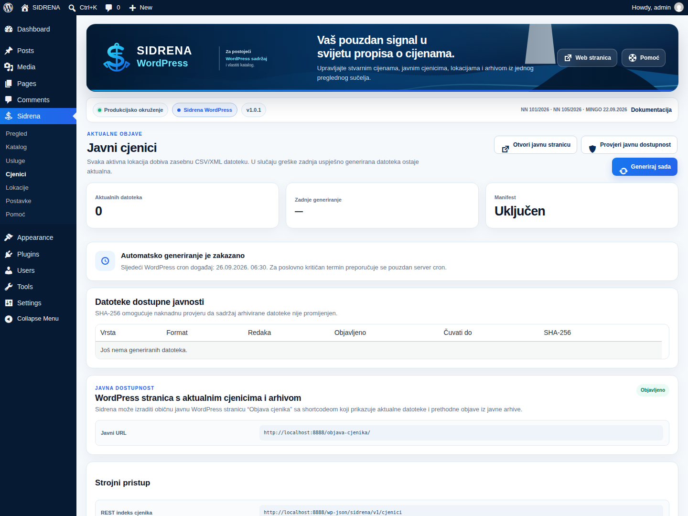
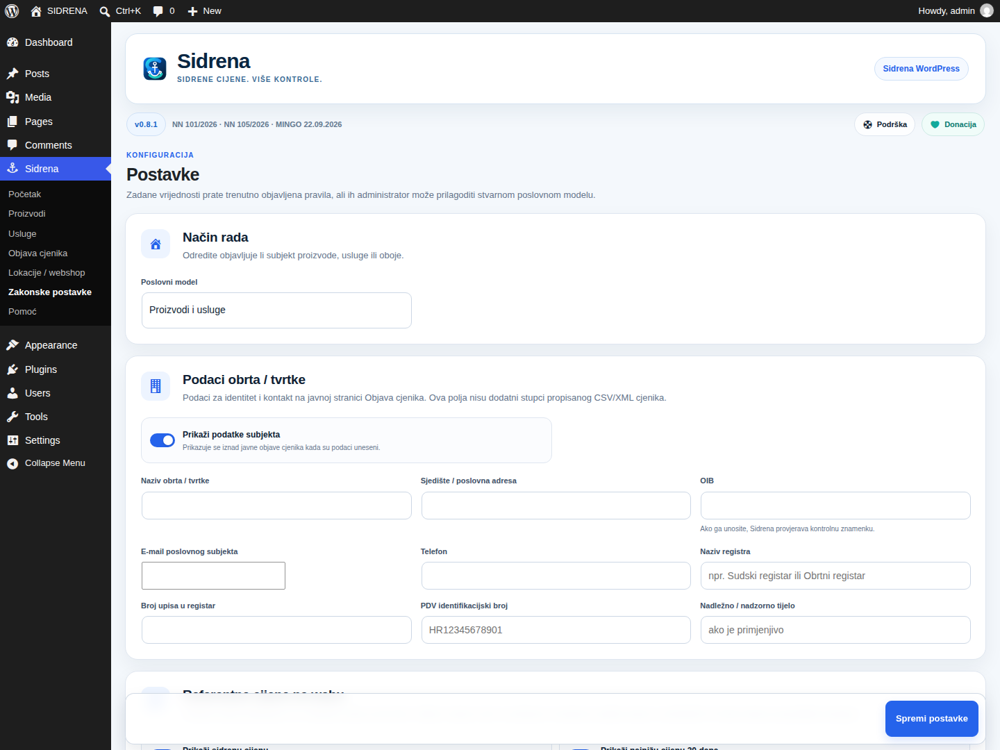
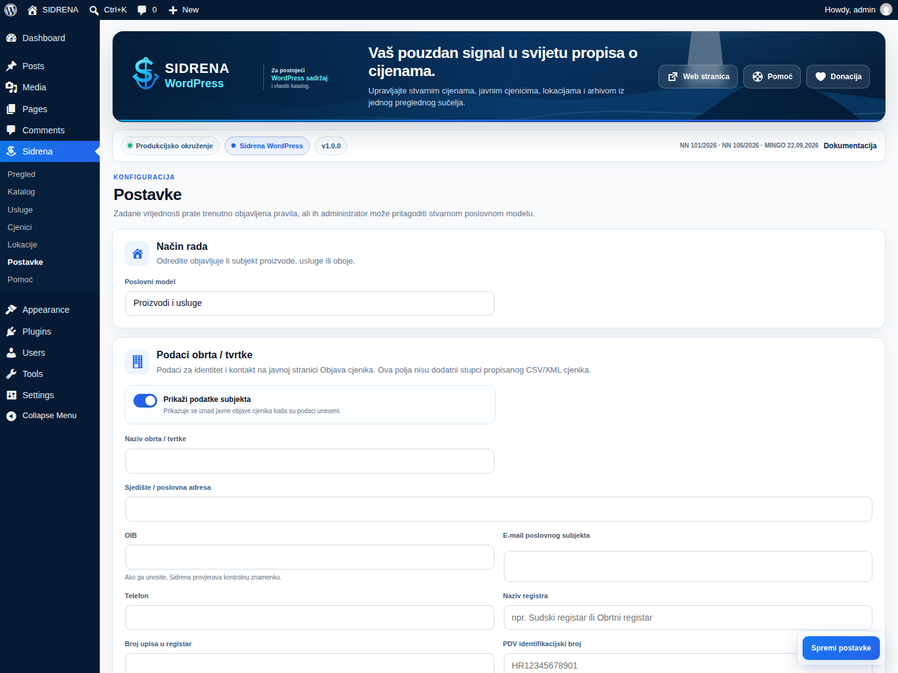
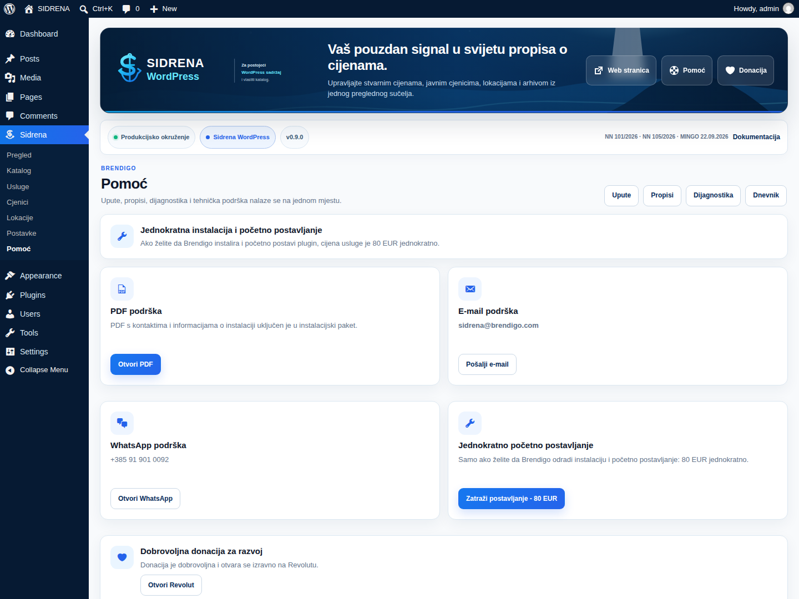
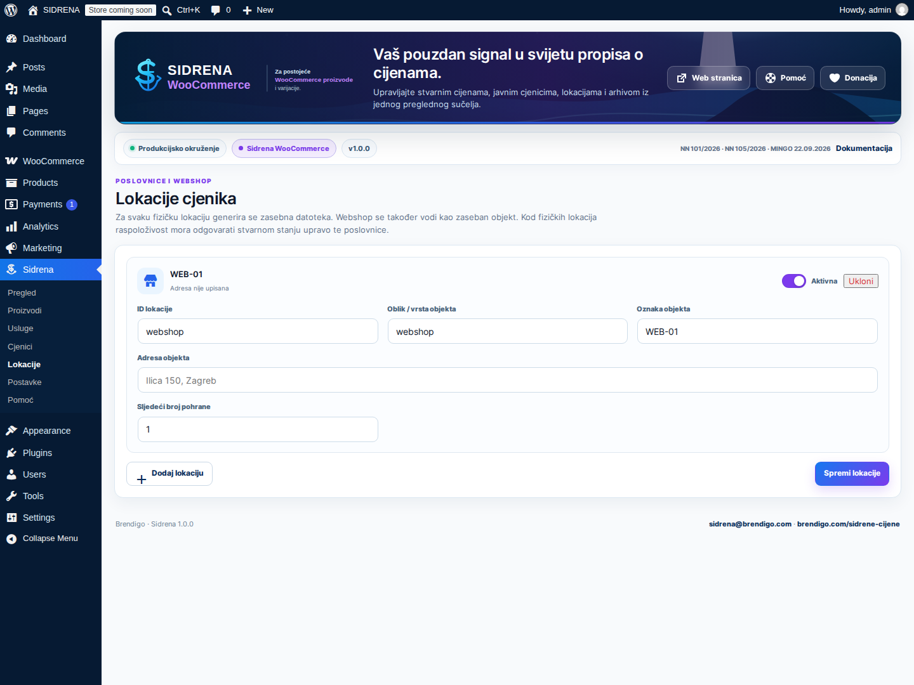
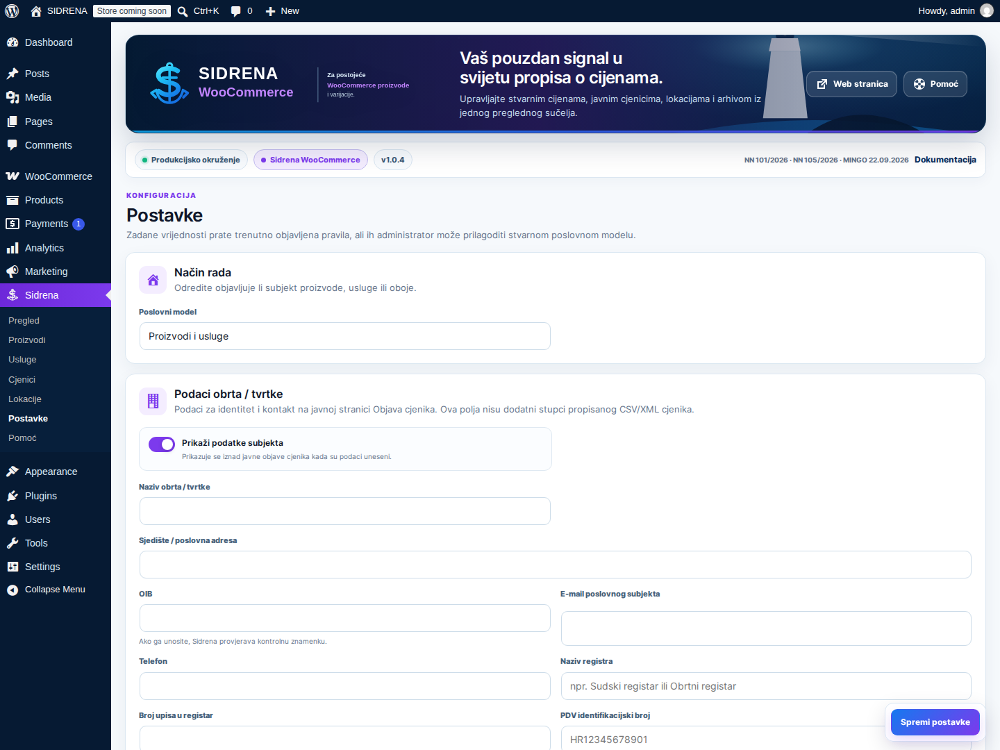

<!--
Sidrena source file.
Author: Brendigo
Author URI: https://brendigo.com/
Plugin URI: https://brendigo.com/sidrene-cijene/
Support: sidrena@brendigo.com
-->

<p align="center">
  
</p>

<h1 align="center">SIDRENA 0.9.0</h1>

<p align="center">
  <strong>Upravljanje cijenama. Jasna evidencija. Sigurnija objava.</strong><br>
  Profesionalni WordPress sustav za katalog, povijest cijena, javne cjenike, lokacije i automatiziranu objavu — dostupan kao zasebno WordPress i WooCommerce izdanje.
</p>

<p align="center">
  <strong>Jedan Sidrena identitet. Dva namjenska plugina. Bez nepotrebnog dupliciranja vašeg postojećeg sadržaja.</strong>
</p>

<p align="center">
  <a href="https://brendigo.com/sidrene-cijene/"><strong>Službena stranica</strong></a>
  ·
  <a href="mailto:sidrena@brendigo.com"><strong>Podrška</strong></a>
</p>

---

## Odaberite izdanje koje odgovara vašem WordPress sustavu

<table>
<tr>
<td width="50%" valign="top">
<p align="center"></p>
<p><strong>Sidrena WordPress</strong> namijenjena je web stranicama koje žele upravljati cijenama kroz vlastiti katalog ili postojeći javni WordPress sadržaj.</p>
<ul>
<li>proizvodi i usluge</li>
<li>povezivanje s postojećim WordPress sadržajem</li>
<li>javni HTML cjenik</li>
<li>CSV/XML izvoz</li>
<li>lokacije i arhiva objava</li>
<li>povijest i referentni podaci o cijenama</li>
</ul>
</td>
<td width="50%" valign="top">
<p align="center"></p>
<p><strong>Sidrena WooCommerce</strong> radi izravno s postojećim WooCommerce proizvodima i varijacijama.</p>
<ul>
<li>bez zasebnog duplog kataloga</li>
<li>proizvodi i varijacije</li>
<li>povijest cijena</li>
<li>lokacije / webshop kanali</li>
<li>javni cjenici i arhiva</li>
<li>automatska sinkronizacija podataka</li>
</ul>
</td>
</tr>
</table>

> Istodobno smije biti aktivno samo jedno Sidrena izdanje. Ugrađeni edition-conflict guard sprječava dvostruke hookove, duplicirane procese i paralelnu objavu iz oba izdanja.

## Pogledajte SIDRENA 0.9.0 u stvarnom WordPress okruženju

Ovo su stvarni ekrani aktivnih pluginova, a ne dizajnerski mockupovi. Galerija se automatski snima iz pravog WordPress administratorskog sučelja; WooCommerce izdanje snima se uz aktivan WooCommerce.

### Sidrena WordPress

<table>
<tr>
<td width="50%"></td>
<td width="50%"></td>
</tr>
<tr>
<td width="50%"></td>
<td width="50%"></td>
</tr>
<tr>
<td width="50%"></td>
<td width="50%"></td>
</tr>
</table>

### Sidrena WooCommerce

<table>
<tr>
<td width="50%"></td>
<td width="50%"></td>
</tr>
<tr>
<td width="50%"></td>
<td width="50%"></td>
</tr>
<tr>
<td width="50%"></td>
<td width="50%"></td>
</tr>
</table>

## Stvarne ikone i identitet

<table>
<tr>
<td align="center"><br><strong>WordPress</strong></td>
<td align="center"><br><strong>WooCommerce</strong></td>
<td align="center"><br><strong>WP admin sidro</strong></td>
<td align="center"><br><strong>App / WP.org ikona</strong></td>
</tr>
</table>

Kompletan vizualni sustav nalazi se u `branding/`, dok su svi runtime logotipi i ikone lokalno u `assets/images/`. Svaki instalacijski ZIP 0.9.0 sada nosi i vlastiti edition-specific SVG branding te gotove PNG hero, cover, CTA, dokumentacijske, app-card i kompaktne assete u `branding/rendered/`. Plugin ne ovisi o vanjskom CDN-u za svoj administratorski identitet.

## Zašto SIDRENA 0.9.0

**SIDRENA 0.9.0** spaja svakodnevni rad s cijenama i produkcijski administratorski UX u jedan pregledan sustav. Umjesto paralelnih tablica, ručnih izvoza i odvojenih evidencija, Sidrena koristi podatke vašeg odabranog izdanja i daje vam jasnije mjesto za upravljanje objavom i poviješću cijena.

Izdanje 0.9.0 donosi:

- novi navy/cyan Sidrena administratorski sustav izrađen od nule
- kompaktna S + sidro ikona u WordPress bočnom meniju
- zasebni WordPress plavi i WooCommerce ljubičasti edition akcent
- responzivne nadzorne ploče, tablice, statusne kartice i obrasci
- redizajnirani katalog, cjenici, lokacije, arhiva, postavke i pomoć
- lokalni logo, app icon, favicon, hero i edition-specific asseti
- stvarni WordPress.org screenshotovi snimljeni iz aktivnog wp-admin okruženja
- CI provjera runtime grešaka, ključnih preklapanja i horizontalnog overflowa na desktop, tablet i mobilnim širinama
- WordPress.org ikone i banneri pripremljeni zasebno za oba izdanja
- kompletan edition-specific SVG + PNG branding paket prenesen je u oba instalacijska plugina

## Sve bitno za rad s cijenama na jednom mjestu

- aktualna, referentna i povijesna cijena
- najniža cijena u prethodnom razdoblju kada je primjenjiva i dostupna u evidenciji
- jedinična cijena kada je primjenjiva
- proizvodi, usluge, WooCommerce varijacije i lokacije
- javni HTML cjenik
- CSV/XML izvoz
- arhiva prethodnih objava
- automatizirana dnevna objava i provjera propuštenog rasporeda
- streaming obrada većih kataloga
- lokalni audit zapis
- nonce/capability zaštita administrativnih akcija
- bez ugrađene telemetrije i praćenja korisnika

## WordPress administracija

Glavni Sidrena meni je namjerno kratak i pregledan:

- **Pregled**
- **Katalog** / **Proizvodi**
- **Usluge**
- **Cjenici**
- **Lokacije**
- **Postavke**
- **Pomoć**

Sekundarne funkcije poput arhive, tehničke provjere, dijagnostike, dnevnika i dokumentacije otvaraju se unutar postojećih radnih stranica umjesto dupliciranja stavki u WordPress bočnom meniju.

## Javni cjenik i ugradnja

Sidrena može objaviti javni cjenik i prikazati ga na WordPress stranici. Dostupan je i shortcode:

`[sidrena_objava_cjenika]`

To omogućuje ugradnju Sidrena javnog prikaza cijena u postojeći sadržaj bez dupliciranja podataka.

## WordPress.org asseti

Za oba izdanja repozitorij održava zaseban WordPress.org set:

- `wporg-assets/sidrena-wordpress/assets/`
- `wporg-assets/sidrena-woocommerce/assets/`

Svaki set uključuje šest stvarnih runtime screenshotova glavnih Sidrena ekrana, ikone 128×128 i 256×256 te bannere. Screenshot pipeline podiže pravi WordPress, a za WooCommerce izdanje i pravi WooCommerce, aktivira Sidrena plugin i tek tada snima sučelje.

## Dokumentacija i branding

- WordPress upute: `docs/UPUTE-WORDPRESS.md`
- WooCommerce upute: `docs/UPUTE-WOOCOMMERCE.md`
- brand vodič: `branding/BRAND-GUIDE.md`
- runtime logotipi i ikone: `assets/images/`
- stvarne slike administracije: `wporg-assets/*/assets/screenshot-*.png`
- tehničke i pravne napomene: `docs/legal-and-technical-notes.md`
- PDF podrška nastaje pri buildu i ulazi u oba instalacijska paketa

## Build

```bash
./tools/build-editions.sh 0.9.0 /tmp/sidrena-build
```

Build proizvodi dva službena instalacijska ZIP paketa:

- `sidrena-wordpress-0.9.0.zip`
- `sidrena-woocommerce-0.9.0.zip`

Uz ZIP-ove lokalno nastaju i SHA-256 kontrolne datoteke za provjeru reproduktivnog builda.

## Privatnost bez ugrađenog praćenja

Sidrena nema ugrađenu telemetriju. Vanjske poveznice prema službenoj stranici, podršci, WhatsAppu i dobrovoljnoj donaciji otvaraju se samo nakon korisničke akcije. Provjera vlastitih javnih datoteka koristi WordPress HTTP API.

## Tehnička pomoć bez lažnih pravnih obećanja

Sidrena tehnički pomaže voditi, provjeravati i objavljivati podatke o cijenama prema pravilima koja projekt prati. Plugin nije automatska pravna potvrda konkretnog poslovanja. Povijesne i referentne cijene moraju odgovarati stvarnoj poslovnoj evidenciji, a korisnik mora provjeriti primjenjivost obveza na svoj poslovni model.

## Podrška

- Službena stranica: **https://brendigo.com/sidrene-cijene/**
- E-mail: **sidrena@brendigo.com**
- Telefon / WhatsApp: **+385 91 901 0092**
- Autor: **Brendigo**

## Licenca

Sidrena se distribuira pod licencom **GPLv2 ili novijom**. Pogledajte [LICENSE](LICENSE).
