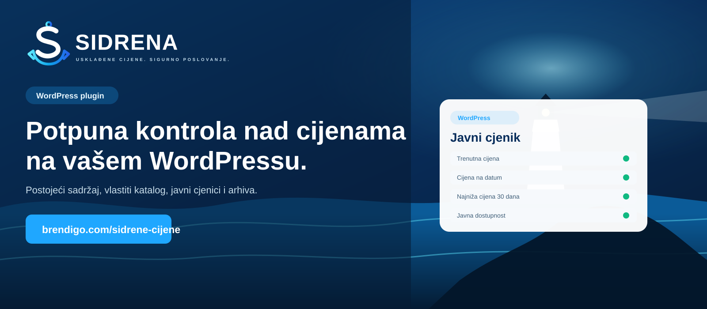
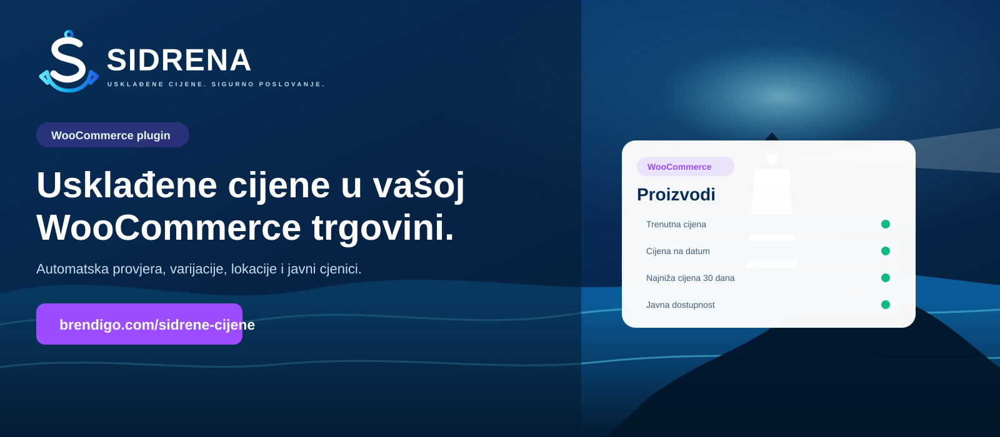

<!--
Sidrena source file.
Author: brendigo
Author URI: https://brendigo.com/
Plugin URI: https://brendigo.com/sidrene-cijene/
Support: sidrena@brendigo.com
-->

<p align="center">
  
</p>

<p align="center">
  
  
</p>

<h1 align="center">SIDRENA 1.0.23</h1>

<p align="center">
  <strong>Upravljanje cijenama. Jasna evidencija. Sigurnija objava.</strong><br>
  Profesionalni WordPress sustav za katalog, povijest cijena, javne cjenike, lokacije i automatiziranu objavu — dostupan kao zasebno WordPress i WooCommerce izdanje.
</p>

<p align="center">
  <strong>Jedan Sidrena identitet. Dva namjenska plugina. Bez nepotrebnog dupliciranja vašeg postojećeg sadržaja.</strong>
</p>

## Stvarni SIDRENA vizualni identitet

Svi vizuali ispod učitavaju se **izravno iz produkcijskih asseta ovog repozitorija**. To nisu zamjenske slike ni vanjski stock materijali: README prikazuje stvarne SIDRENA logotipe, ikone, WordPress.org bannere i aktualne renderirane brand vizuale koji se koriste za projekt.

<table>
<tr>
<td width="50%" align="center"><br><strong>SIDRENA WordPress logo</strong></td>
<td width="50%" align="center"><br><strong>SIDRENA WooCommerce logo</strong></td>
</tr>
<tr>
<td width="50%" align="center"><br><strong>WordPress plugin cover</strong></td>
<td width="50%" align="center"><br><strong>WooCommerce plugin cover</strong></td>
</tr>
</table>

### Ikone i brand mark

<table>
<tr>
<td align="center"><br><strong>Logo mark</strong></td>
<td align="center"><br><strong>App ikona</strong></td>
<td align="center"><br><strong>Favicon</strong></td>
<td align="center"><br><strong>Admin menu ikona</strong></td>
<td align="center"><br><strong>WP.org WordPress</strong></td>
<td align="center"><br><strong>WP.org WooCommerce</strong></td>
</tr>
</table>

### Aktualni WordPress.org banneri

<table>
<tr>
<td width="50%" align="center"></td>
<td width="50%" align="center"></td>
</tr>
</table>

<p align="center">
  <a href="https://brendigo.com/sidrene-cijene/"><strong>Službena stranica</strong></a>
  ·
  <a href="mailto:sidrena@brendigo.com"><strong>Podrška</strong></a>
</p>

---

## Za koga je SIDRENA

SIDRENA je namijenjena vlasnicima i administratorima WordPress stranica koji žele voditi cijene, povijest promjena, javne cjenike i lokacije iz jednog preglednog administratorskog sustava — bez izmišljanja paralelnog kataloga ondje gdje sadržaj već postoji.

- **WordPress izdanje** povezuje postojeće objave, stranice ili prilagođene vrste sadržaja, a po potrebi koristi i vlastiti katalog proizvoda i usluga.
- **WooCommerce izdanje** radi izravno s postojećim WooCommerce proizvodima i varijacijama, bez dupliciranja kataloga.
- Oba izdanja koriste isti SIDRENA vizualni sustav, javni cjenik, CSV/XML izvoz, arhivu, lokacije, povijest i automatiziranu objavu.

## Odaberite izdanje koje odgovara vašem WordPress sustavu

<table>
<tr>
<td width="50%" valign="top">
<p align="center"></p>
<p><strong>Sidrena WordPress</strong> namijenjena je web stranicama koje žele upravljati cijenama kroz vlastiti katalog ili postojeći javni WordPress sadržaj.</p>
<ul>
<li>proizvodi i usluge</li>
<li>povezivanje s postojećim WordPress sadržajem</li>
<li>javni HTML cjenik</li>
<li>CSV/XML izvoz</li>
<li>lokacije i arhiva objava</li>
<li>povijest i referentni podaci o cijenama</li>
</ul>
</td>
<td width="50%" valign="top">
<p align="center"></p>
<p><strong>Sidrena WooCommerce</strong> radi izravno s postojećim WooCommerce proizvodima i varijacijama.</p>
<ul>
<li>bez zasebnog duplog kataloga</li>
<li>proizvodi i varijacije</li>
<li>povijest cijena</li>
<li>lokacije / webshop kanali</li>
<li>javni cjenici i arhiva</li>
<li>automatska sinkronizacija podataka</li>
</ul>
</td>
</tr>
</table>

> Istodobno smije biti aktivno samo jedno Sidrena izdanje. Ugrađeni edition-conflict guard sprječava dvostruke hookove, duplicirane procese i paralelnu objavu iz oba izdanja.

## Stvarni ekrani plugina — bez mockupova

Slike ispod su **stvarni runtime screenshotovi SIDRENA plugina** snimljeni iz aktivnog WordPress administratorskog sučelja. Nisu mockupovi niti generirani prikazi. WordPress galerija nastaje s aktivnim SIDRENA WordPress izdanjem, a WooCommerce galerija s aktivnim WooCommerceom i SIDRENA WooCommerce izdanjem.

### SIDRENA WordPress — stvarni wp-admin

<table>
<tr>
<td width="50%"></td>
<td width="50%"></td>
</tr>
<tr>
<td width="50%"></td>
<td width="50%"></td>
</tr>
<tr>
<td width="50%"></td>
<td width="50%"></td>
</tr>
</table>

### SIDRENA WooCommerce — stvarni wp-admin

<table>
<tr>
<td width="50%"></td>
<td width="50%"></td>
</tr>
<tr>
<td width="50%"></td>
<td width="50%"></td>
</tr>
<tr>
<td width="50%"></td>
<td width="50%"></td>
</tr>
</table>

Kompletan vizualni sustav i WordPress.org marketinški asseti ostaju u izvornom repozitoriju (`branding/` i `wporg-assets/`). Instalacijski ZIP 1.0.23 sadrži samo runtime logotipe/ikone iz `assets/images/`, kod, prijevode, tekstualne upute i PDF podršku. Time se ne gubi izgled plugina, ali se iz instalacijskog paketa uklanja nekoliko megabajta sadržaja koji WordPressu nije potreban za rad.

## Zašto SIDRENA 1.0.23

**SIDRENA 1.0.23** je release usmjeren na pojednostavljen hrvatski workflow, sigurniju automatizaciju objave, detaljne korisničke upute i WordPress.org usklađivanje oba produkcijska izdanja.

Izdanje 1.0.23 donosi:

- automatski uključene publication-critical funkcije bez rizičnih korisničkih prekidača
- pojednostavljene postavke za krajnjeg korisnika
- detaljne hrvatske Markdown i PDF upute za oba izdanja
- WooCommerce store-address onboarding bez prepisivanja postojećih lokacija
- poboljšan variation reference-price payload bez dodatnog zahtjeva u standardnom toku
- javne podatke o integritetu datoteka i poboljšanu arhivu/preuzimanja
- validirane hookove za dodatne jedinice i aliase
- WordPress.org naming/slug/trademark/admin-notice cleanup prema recenzentskim smjernicama
- proširene CI, Plugin Check i runtime QA guardove.

## Sve bitno za rad s cijenama na jednom mjestu

- aktualna, referentna i povijesna cijena
- najniža cijena u prethodnom razdoblju kada je primjenjiva i dostupna u evidenciji
- jedinična cijena kada je primjenjiva
- proizvodi, usluge, WooCommerce varijacije i lokacije
- javni HTML cjenik
- CSV/XML izvoz
- arhiva prethodnih objava
- automatizirana dnevna objava proizvoda, regeneriranje nakon promjena usluga i provjera propuštenog rasporeda
- streaming obrada većih kataloga
- lokalni audit zapis
- nonce/capability zaštita administrativnih akcija
- bez ugrađene telemetrije i praćenja korisnika

## WordPress administracija

Glavni Sidrena meni je namjerno kratak i pregledan:

- **Pregled**
- **Katalog** / **Proizvodi**
- **Usluge**
- **Cjenici**
- **Lokacije**
- **Postavke**
- **Pomoć**

Sekundarne funkcije poput arhive, tehničke provjere, dijagnostike, dnevnika i dokumentacije otvaraju se unutar postojećih radnih stranica umjesto dupliciranja stavki u WordPress bočnom meniju.

## Javni cjenik i ugradnja

Sidrena može objaviti javni cjenik i prikazati ga na WordPress stranici. Dostupan je i shortcode:

`[sidrena_objava_cjenika]`

To omogućuje ugradnju Sidrena javnog prikaza cijena u postojeći sadržaj bez dupliciranja podataka.

## WordPress.org asseti

Za oba izdanja repozitorij održava zaseban WordPress.org set:

- `wporg-assets/sidrena-wordpress/assets/`
- `wporg-assets/sidrena-woocommerce/assets/`

Svaki set uključuje šest stvarnih runtime screenshotova glavnih Sidrena ekrana, ikone 128×128 i 256×256 te bannere. Screenshot pipeline podiže pravi WordPress, a za WooCommerce izdanje i pravi WooCommerce, aktivira Sidrena plugin i tek tada snima sučelje.

## Dokumentacija i branding

- WordPress upute: `docs/UPUTE-WORDPRESS.md`
- WooCommerce upute: `docs/UPUTE-WOOCOMMERCE.md`
- brand vodič: `branding/BRAND-GUIDE.md`
- runtime logotipi i ikone: `assets/images/`
- stvarne slike administracije: `wporg-assets/*/assets/screenshot-*.png`
- tehničke i pravne napomene: `docs/legal-and-technical-notes.md`
- PDF podrška nastaje pri buildu i ulazi u oba instalacijska paketa

## Build

```bash
./tools/build-editions.sh 1.0.23 /tmp/sidrena-build
```

Build proizvodi dva službena instalacijska ZIP paketa:

- `sidrena-wordpress-1.0.23.zip`
- `sidrena-woocommerce-1.0.23.zip`

Uz ZIP-ove lokalno nastaju i SHA-256 kontrolne datoteke za provjeru reproduktivnog builda. Build prekida ako je bilo koji instalacijski ZIP veći od 1,5 MiB.

## Nadogradnja sa starijih SIDRENA verzija

SIDRENA koristi zaseban marker instalirane verzije za sigurne idempotentne nadogradnje. Ako se novije izdanje instalira preko bilo kojeg ranijeg SIDRENA WordPress izdanja ili preko bilo kojeg ranijeg SIDRENA WooCommerce izdanja, plugin pokreće idempotentni repair/migration prolaz: provjerava i po potrebi obnavlja tablice, postavke, upload direktorije, cron rasporede i javnu stranicu, bez brisanja postojećih poslovnih podataka. WordPress i WooCommerce izdanje i dalje se ne smiju istodobno aktivirati.

## Privatnost bez ugrađenog praćenja

Sidrena nema ugrađenu telemetriju. Vanjske poveznice prema službenoj stranici, podršci, WhatsAppu i dobrovoljnoj donaciji otvaraju se samo nakon korisničke akcije. Provjera vlastitih javnih datoteka koristi WordPress HTTP API.

## Tehnička pomoć bez lažnih pravnih obećanja

Sidrena tehnički pomaže voditi, provjeravati i objavljivati podatke o cijenama prema pravilima koja projekt prati. Plugin nije automatska pravna potvrda konkretnog poslovanja. Povijesne i referentne cijene moraju odgovarati stvarnoj poslovnoj evidenciji, a korisnik mora provjeriti primjenjivost obveza na svoj poslovni model.

## Podrška

- Službena stranica: **https://brendigo.com/sidrene-cijene/**
- E-mail: **sidrena@brendigo.com**
- Telefon / WhatsApp: **+385 91 901 0092**
- Autor: **brendigo**

## Licenca

Sidrena se distribuira pod licencom **GPLv2 ili novijom**. Pogledajte [LICENSE](LICENSE).
