<!--
Sidrena source file.
Author: brendigo
Author URI: https://brendigo.com/
Plugin URI: https://brendigo.com/sidrene-cijene/
Support: sidrena@brendigo.com
-->

  

<h1 align="center">SIDRENA 1.0.0</h1>

  <strong>Sidrena cijena, povijest cijena i digitalni cjenici — ozbiljno riješeni za WordPress.</strong> 
  Dva zasebna plugina, jedan proizvodni sustav: samostalno WordPress izdanje i izdanje za WooCommerce.

  <a href="https://github.com/bren-wp/SIDRENA/releases/tag/v1.0.0"><strong>Preuzmi 1.0.0</strong></a>
  ·
  <a href="https://brendigo.com/sidrene-cijene/"><strong>Službena stranica</strong></a>
  ·
  <a href="mailto:sidrena@brendigo.com"><strong>Podrška</strong></a>

  
  &nbsp;&nbsp;
  
  &nbsp;&nbsp;
  
  &nbsp;&nbsp;
  

---

## Cijene nisu samo broj. SIDRENA čuva kontekst.

SIDRENA je WordPress sustav za tvrtke koje trebaju pouzdano voditi i objavljivati **aktualnu cijenu, sidrenu/referentnu cijenu, datum sidrene cijene, povijest promjena, jedinične cijene, lokacije i digitalne cjenike**.

Središnji podatak je **SIDRENA cijena**. Ona je u modelu podataka i korisničkom sučelju odvojena od aktualne cijene, najniže cijene u prethodnih 30 dana i WooCommerce akcijske cijene.

<table>
<tr>
<td width="25%" valign="top"><strong>⚓ SIDRENA cijena</strong> Referentna vrijednost, datum, izvor, status i audit trag.</td>
<td width="25%" valign="top"><strong>🕘 Povijest</strong> Neograničena evidencija stvarnih promjena cijena bez jednog rastućeg autoload optiona.</td>
<td width="25%" valign="top"><strong>📄 Cjenici</strong> Javni HTML te strojno čitljivi CSV/XML izlazi, aktualna verzija i arhiva.</td>
<td width="25%" valign="top"><strong>🛡️ Sigurna objava</strong> Atomic write, locking, SHA-256, duplicate detection i očuvanje zadnje valjane verzije.</td>
</tr>
</table>

## Ovako SIDRENA stvarno izgleda

Ovo nisu mockupovi niti generirane ilustracije. Slike ispod snimljene su iz **stvarno pokrenutog WordPress wp-admina** u GitHub QA pipelineu. Za WooCommerce galeriju workflow prvo instalira i aktivira WooCommerce, zatim SIDRENA izdanje i tek tada snima sučelje.

<table>
<tr>
<td width="50%" align="center">
 
<strong>SIDRENA — WordPress izdanje</strong> 
Pregled sustava, status objave i operativne provjere.
</td>
<td width="50%" align="center">
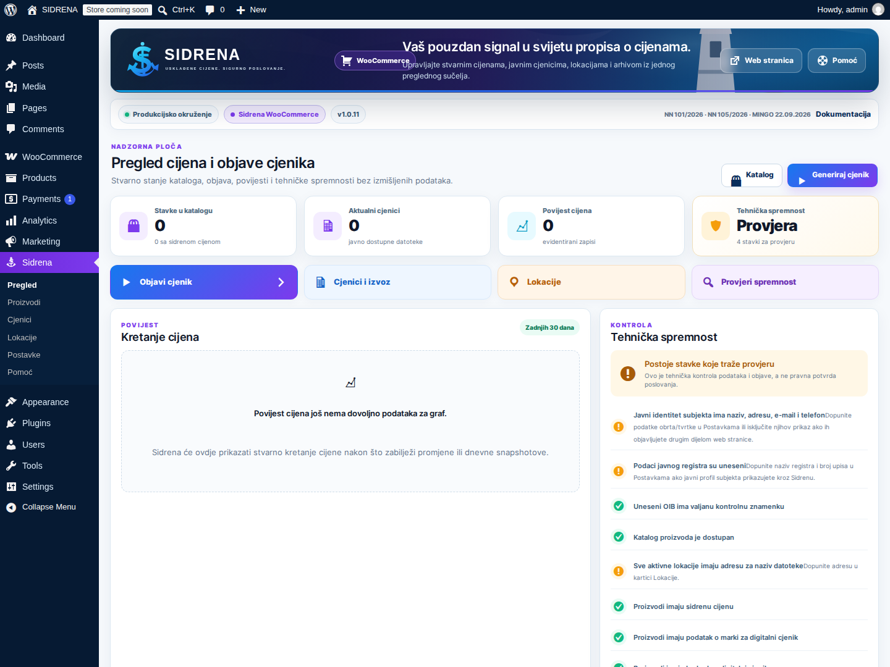 
<strong>SIDRENA — WooCommerce izdanje</strong> 
Isti SIDRENA sustav nad stvarnim WooCommerce katalogom.
</td>
</tr>
</table>

### Katalog i SIDRENA podaci

<table>
<tr>
<td width="50%"></td>
<td width="50%"></td>
</tr>
<tr>
<td align="center"><strong>Samostalni katalog</strong></td>
<td align="center"><strong>WooCommerce proizvodi i varijacije</strong></td>
</tr>
</table>

### Digitalni cjenici i arhiva

<table>
<tr>
<td width="50%">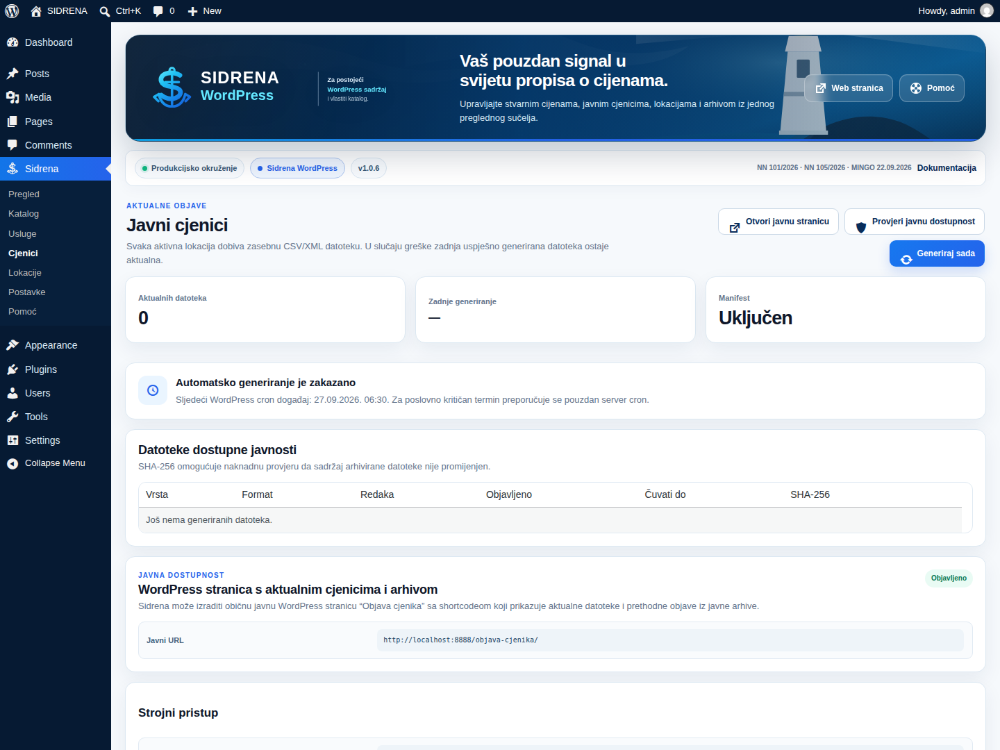</td>
<td width="50%">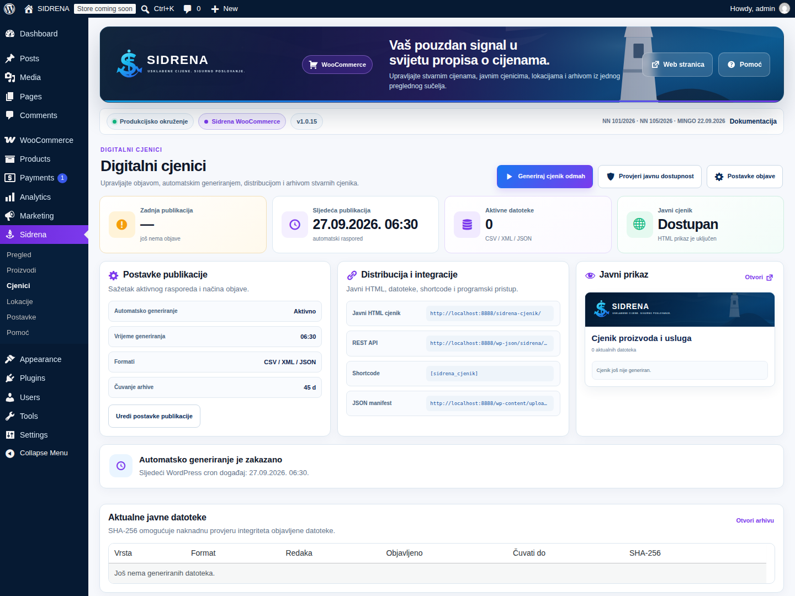</td>
</tr>
</table>

### Lokacije, postavke i pomoć

<table>
<tr>
<td width="33%">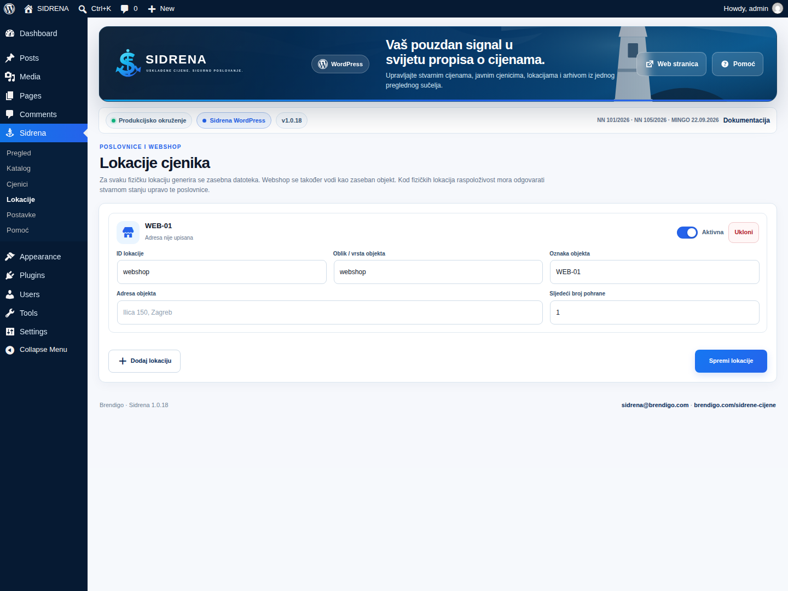 <strong>Lokacije</strong></td>
<td width="33%">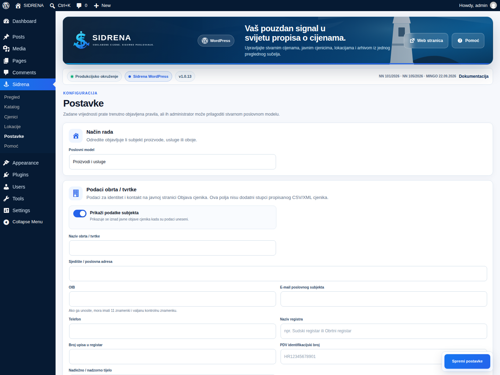 <strong>Postavke</strong></td>
<td width="33%"> <strong>Pomoć i alati</strong></td>
</tr>
</table>

### WooCommerce izdanje — lokacije, postavke i pomoć

<table>
<tr>
<td width="33%"> <strong>Lokacije</strong></td>
<td width="33%">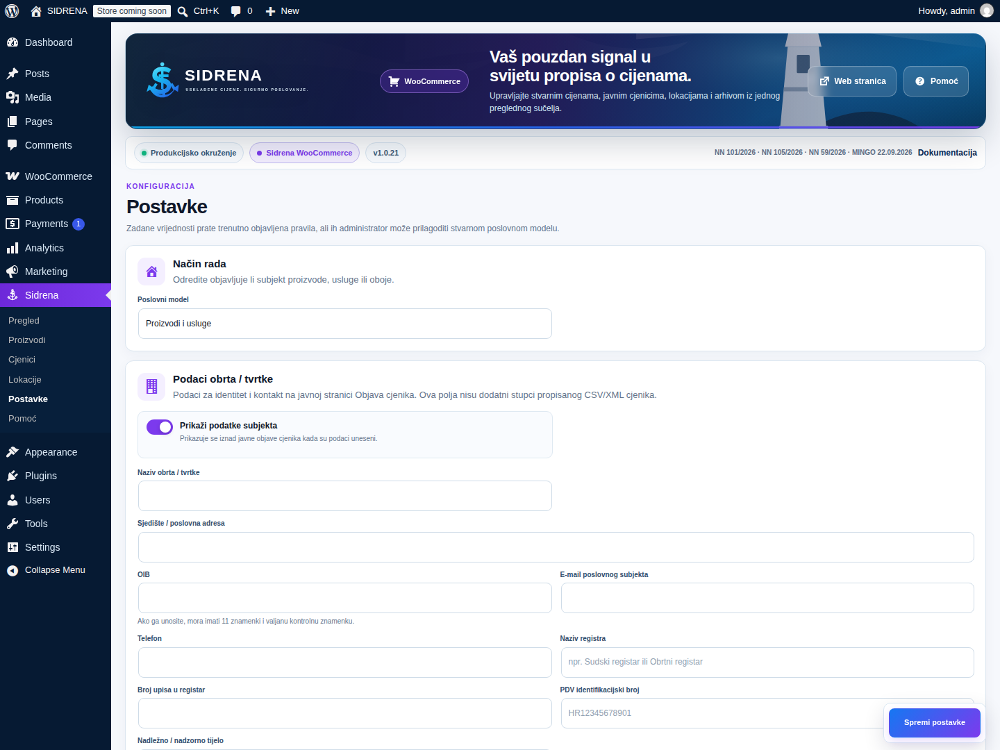 <strong>Postavke</strong></td>
<td width="33%">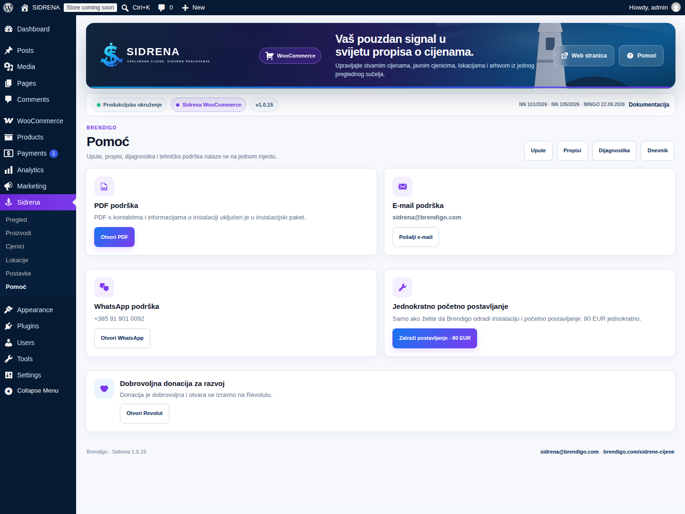 <strong>Pomoć i alati</strong></td>
</tr>
</table>

> Stvarni screenshotovi koji se koriste u README-u isti su asseti pripremljeni za WordPress.org: <code>wporg-assets/*/assets/screenshot-*.png</code>.

---

## Dva izdanja. Bez duplog kataloga.

<table>
<tr>
<td width="50%" valign="top">

### SIDRENA — WordPress izdanje

Za web stranice koje nemaju WooCommerce ili žele vlastiti SIDRENA katalog.

- proizvodi i usluge
- vlastiti katalog
- povezivanje s postojećim WordPress sadržajem
- CSV/XML uvoz i izvoz
- više poslovnica i webshop kanala
- javni digitalni cjenik
- arhiva i audit
- REST i JSON manifest
- bez WooCommerce dependencyja

**Javni slug / text-domain:**  
<code>brendigo-sidrene-cijene-digitalni-cjenici</code>

</td>
<td width="50%" valign="top">

### SIDRENA — WooCommerce izdanje

Za trgovine koje već imaju WooCommerce proizvode i varijacije.

- postojeći WooCommerce katalog ostaje source of truth
- simple products
- variable products i svaka variation
- regular / sale / current lifecycle
- scheduled sale promjene
- bulk SIDRENA editor
- više lokacija
- povijest po proizvodu, varijaciji i lokaciji
- automatsko osvježavanje cjenika nakon relevantnih promjena

**Requires Plugins:** <code>woocommerce</code>  
**Javni slug / text-domain:**  
<code>brendigo-sidrena-cijena</code>

</td>
</tr>
</table>

Istodobno smije biti aktivno samo jedno SIDRENA izdanje. Ugrađeni edition-conflict guard sprječava dvostruke hookove, paralelno generiranje i nejasan izvor podataka.

---

## Što SIDRENA vodi

| Podatak / funkcija | WordPress izdanje | WooCommerce izdanje |
|---|:---:|:---:|
| Aktualna cijena | ✅ | ✅ |
| SIDRENA / referentna cijena | ✅ | ✅ |
| Datum SIDRENA cijene | ✅ | ✅ |
| Item-level iznimka za novu stavku | ✅ | ✅ |
| Najniža cijena prethodnih 30 dana kao zaseban koncept | — | ✅ |
| Neograničena povijest promjena | ✅ | ✅ |
| Proizvodi | ✅ | ✅ |
| Usluge | ✅ | ✅ |
| Simple products | — | ✅ |
| Variable products / variations | — | ✅ |
| Više poslovnica / lokacija | ✅ | ✅ |
| Cijene po lokaciji | ✅ | ✅ |
| Jedinična cijena | ✅ | ✅ |
| kg / g / l / ml / m / cm / m² / m³ / kom i druge podržane jedinice | ✅ | ✅ |
| CSV import / export | ✅ | ✅ |
| XML javni izlaz | ✅ | ✅ |
| Javni HTML cjenik | ✅ | ✅ |
| REST indeks i JSON manifest | ✅ | ✅ |
| Aktualni cjenik + javna arhiva | ✅ | ✅ |
| WP-Cron ili server cron / WP-CLI | ✅ | ✅ |
| Site Health i watchdog | ✅ | ✅ |

---

## Objavljivanje bez nepotrebnih kopija

SIDRENA razlikuje **aktualni cjenik** od **arhive**.

Kada se cijena promijeni tijekom dana, aktualna verzija može se osvježiti bez stvaranja nove arhivske kopije za svaku pojedinu promjenu. Arhivska publikacija koristi sadržajni hash kako bi se izbjegle identične duplikacije.

Pipeline objave uključuje:

- temporary file
- potpuni zapis i provjeru
- process-level file lock
- atomic rename/commit
- SHA-256 integritet
- duplicate archive detection
- rollback kod neuspjele generacije
- očuvanje posljednje valjane javne verzije
- kontrolirano čuvanje arhive najmanje 30 dana

Ako nova generacija ne uspije, nepotpuna datoteka ne zamjenjuje zadnju valjanu javnu verziju.

---

## Automatizacija koja prati odabrani način rada

U **SIDRENA → Postavke** postoje dva načina dnevne objave:

**Interni WordPress WP-Cron**  
SIDRENA sama održava dnevni WordPress cron događaj.

**Vanjski server cron / WP-CLI**  
Interni dnevni cron namjerno se uklanja, a server pokreće:

<code>wp sidrena publish</code>

Watchdog i Site Health nastavljaju nadzirati objavu u oba načina rada. Dashboard također razlikuje ta dva moda i ne prijavljuje nedostajući interni WP-Cron kao grešku kada je namjerno odabran vanjski scheduler.

---

## Siguran import i rad s velikim katalogom

Import ne vjeruje samo podacima iz browsera.

Provjeravaju se:

- nonce i capability
- upload error
- ekstenzija i MIME
- stvarna veličina privremene datoteke na serveru
- maksimalna veličina
- prazna datoteka
- encoding
- delimiter
- malformed CSV/XML
- broj redaka
- nepoznati proizvodi/lokacije
- nevaljani datumi i decimalne vrijednosti
- nevaljane mjerne jedinice
- duplicate code/SKU scenariji
- CSV formula injection pri izvozu

Standalone import obrađuje katalog u **chunkovima**, a lookup postojećih šifri ograničen je na traženi skup umjesto gradnje cijelog indeksa kataloga u memoriji.

---

## SIDRENA cijena nije WooCommerce sale price

SIDRENA model namjerno razdvaja:

1. **aktualnu cijenu**
2. **SIDRENA / referentnu cijenu**
3. **datum SIDRENA cijene**
4. **najnižu cijenu u prethodnih 30 dana**, kada je primjenjiva
5. **WooCommerce regular/sale/current** stanje

Zakonski referentni datumi iz aktivnog ruleseta prikazuju se kao read-only vrijednosti. Administrator ih ne može globalno prepisati običnom postavkom, importom, REST-om, AJAX-om, bulk editorom ili CLI-em.

Custom datum postoji samo kao dokumentirana **iznimka pojedine nove stavke** i ne mijenja ruleset drugim stavkama.

> SIDRENA je tehnički alat za evidenciju, provjeru i objavu podataka. Ne daje pravno jamstvo i ne zamjenjuje izvornu poslovnu evidenciju ili stručni pravni savjet.

---

## WordPress.org spremnost

Oba production paketa imaju zaseban javni identitet i zaseban WordPress.org asset set.

<table>
<tr>
<td width="50%" align="center">
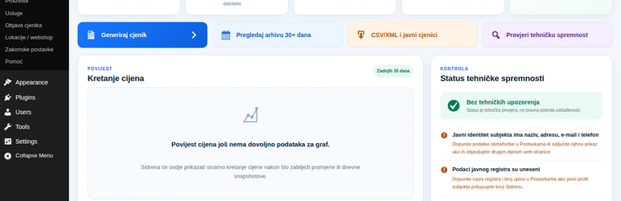 

</td>
<td width="50%" align="center">
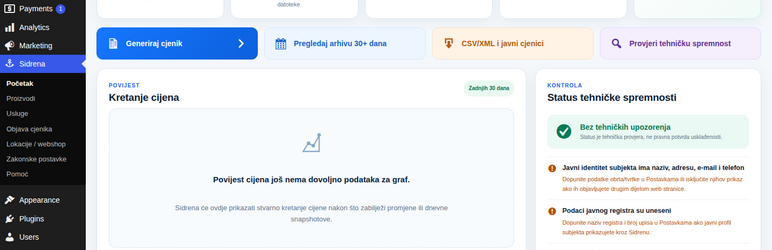 

</td>
</tr>
</table>

QA uključuje:

- PHP syntax: 7.4, 8.3 i 8.4
- WordPress Coding Standards
- PHPStan
- službeni WordPress Plugin Check nad production-shaped paketima
- public slug / text-domain regression guard
- distribution/package guard
- legal automation guard
- edition conflict guard
- dependency guard
- uninstall/upgrade regression testove
- reproducible build
- stvarni wp-admin browser/screenshot QA

WordPress.org odobrenje uvijek uključuje i ručni pregled Plugin Review tima; projekt zato ne tvrdi da automatizirani test može garantirati odobrenje.

---

## Kompatibilnost

- **WordPress:** 6.6+
- **Tested up to:** 7.1
- **PHP:** 7.4+
- **WooCommerce izdanje:** WooCommerce 8.0+
- **WC tested up to:** 11.1.2
- **SIDRENA:** 1.0.0

---

## Javni prikaz

SIDRENA može održavati javni digitalni cjenik i arhivu, a cjenik se može ugraditi i shortcodeom:

<code>[sidrena_objava_cjenika]</code>

Javni prikaz podržava pretragu i lokacijski kontekst bez izlaganja nepotrebnih internih audit podataka.

---

## Privatnost

SIDRENA nema ugrađenu telemetriju, analytics tracking, license key, trial, feature paywall niti remote executable code.

Core funkcije ne zahtijevaju vanjski SaaS račun. Administratorska provjera dostupnosti javnih SIDRENA datoteka koristi WordPress HTTP API prema javnim URL-ovima vlastite instalacije uz validaciju URL-a, ograničenje redirecta i ograničenje veličine odgovora.

---

## Dokumentacija

| Dokument | Namjena |
|---|---|
| [WordPress upute](docs/UPUTE-WORDPRESS.md) | Samostalno WordPress izdanje |
| [WooCommerce upute](docs/UPUTE-WOOCOMMERCE.md) | WooCommerce izdanje |
| [Pravni izvori](docs/LEGAL-SOURCES.md) | Primarni izvori, službena pojašnjenja i tehnička interpretacija |
| [WordPress.org review audit](docs/WORDPRESS-ORG-REVIEW-AUDIT.md) | Submission i security provjere |
| [Brand guide](branding/BRAND-GUIDE.md) | SIDRENA vizualni sustav |

Instalacijski paketi uključuju i edition-specific PDF upute generirane i vizualno provjerene u release pipelineu.

---

## Build

~~~bash
./tools/build-editions.sh 1.0.0 /tmp/sidrena-build
~~~

Dobivaju se dva čista instalacijska paketa:

- <code>sidrena-wordpress-1.0.0.zip</code>
- <code>sidrena-woocommerce-1.0.0.zip</code>

i pripadajuće <code>.sha256</code> kontrolne datoteke.

Production ZIP ne uključuje razvojne workflowe, source-only branding materijal, testove ni druge datoteke koje WordPressu nisu potrebne za rad.

---

## Preuzimanje

  <a href="https://github.com/bren-wp/SIDRENA/releases/download/v1.0.0/sidrena-wordpress-1.0.0.zip"><strong>⬇ SIDRENA — WordPress izdanje</strong></a>
  &nbsp;&nbsp;&nbsp;
  <a href="https://github.com/bren-wp/SIDRENA/releases/download/v1.0.0/sidrena-woocommerce-1.0.0.zip"><strong>⬇ SIDRENA — WooCommerce izdanje</strong></a>

  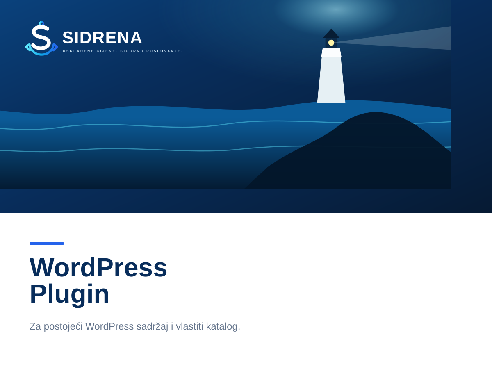
  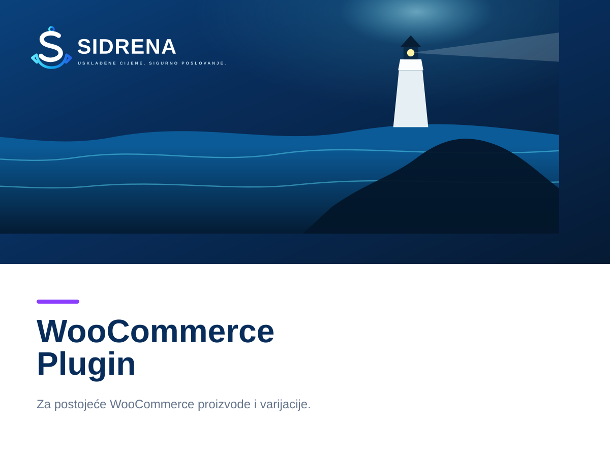

---

## Podrška

- **Web:** https://brendigo.com/sidrene-cijene/
- **E-mail:** sidrena@brendigo.com
- **Telefon / WhatsApp:** +385 91 901 0092
- **Autor:** brendigo

## Licenca

SIDRENA se distribuira pod licencom **GPLv2 ili novijom**. Pogledajte [LICENSE](LICENSE).

  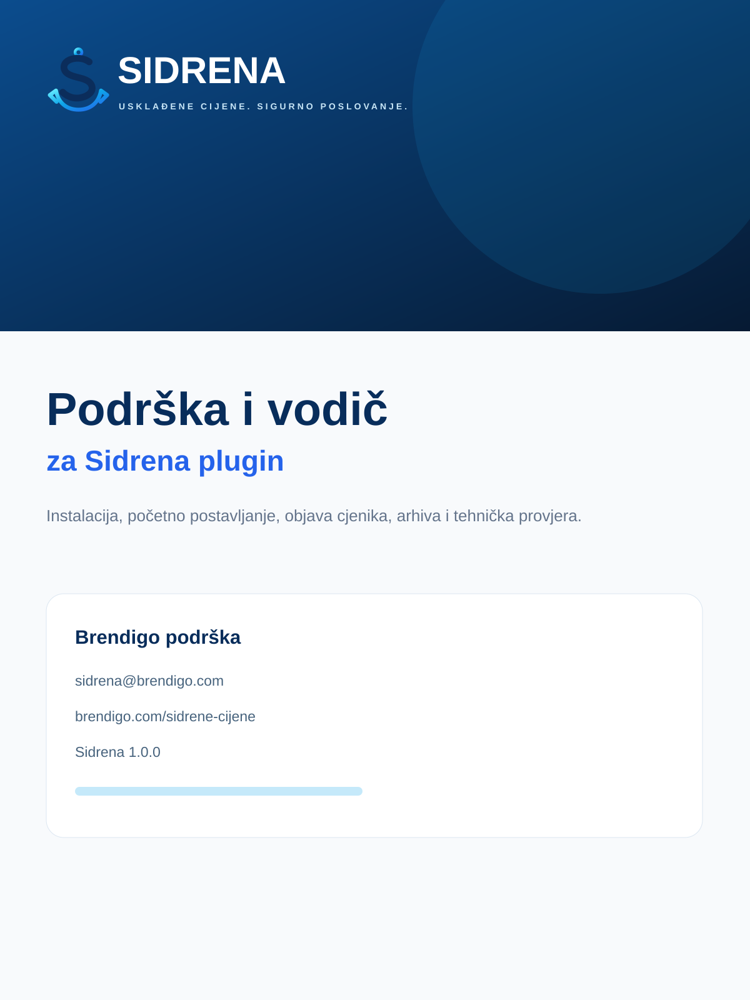

