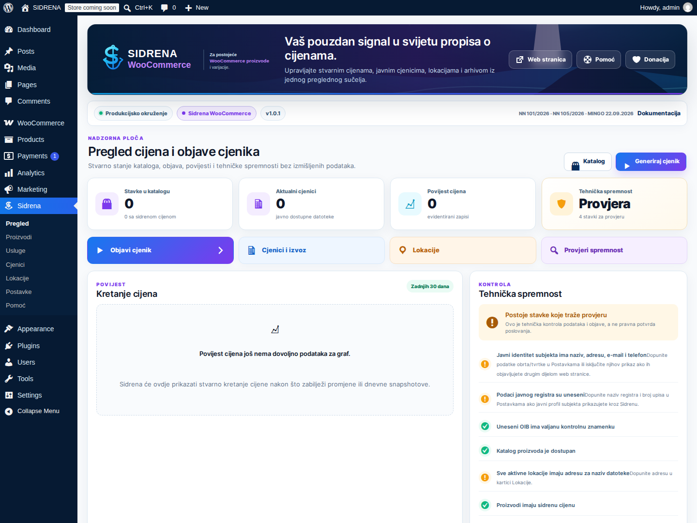
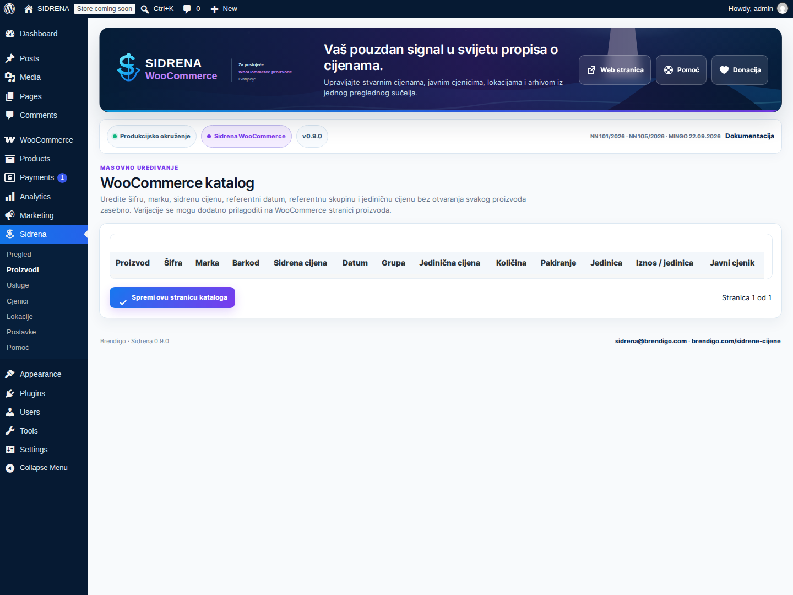
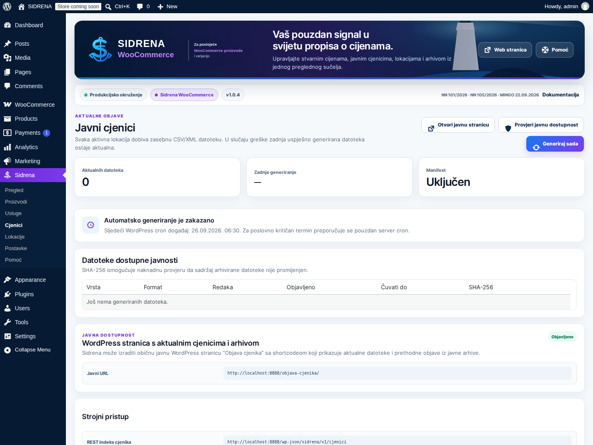
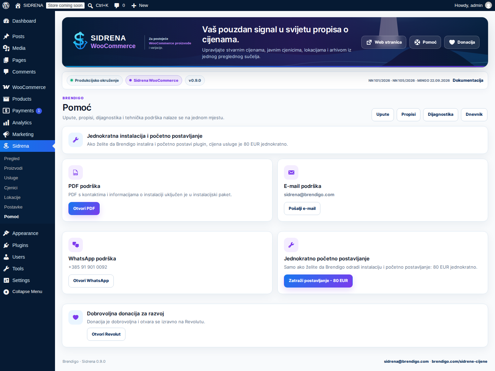

<!--
Sidrena source file.
Author: Brendigo
Author URI: https://brendigo.com/
Plugin URI: https://brendigo.com/sidrene-cijene/
Support: sidrena@brendigo.com
-->

# Sidrena WooCommerce 1.0.1 - Upute za korištenje

> Screenshot se automatski snima iz aktivnog WordPress + WooCommerce admin sučelja pri pripremi WordPress.org asseta. U instalacijskom ZIP-u nalazi se kao `docs/images/screenshot-admin.png`.

## Galerija stvarnog sučelja

<table>
<tr>
<td width="50%"></td>
<td width="50%"></td>
</tr>
<tr>
<td width="50%"></td>
<td width="50%"></td>
</tr>
<tr>
<td width="50%"></td>
<td width="50%"></td>
</tr>
</table>

Svih šest slika snima se iz aktivnog WordPress + WooCommerce okruženja. Ne koriste se dizajnerski mockupovi kao dokaz stvarnog administratorskog sučelja.

## Vizualni sustav 1.0.1

Sidrena 1.0.1 koristi novi produkcijski UI/UX izrađen od nule: tamno plavu navigaciju, lokalni svjetionik vizual, Sidrena S + sidro identitet, responzivne statusne kartice, čiste tablice i jasne akcije. WordPress izdanje koristi plavi akcent, a WooCommerce izdanje uz osnovni Sidrena plavi koristi ljubičasti WooCommerce akcent.

Sve slike u ovoj dokumentaciji dolaze iz stvarnog aktivnog WordPress administratorskog sučelja koje automatski snima CI.

## Namjena

Sidrena WooCommerce namijenjena je WordPress trgovinama s aktivnim WooCommerceom. WooCommerce proizvodi i varijacije ostaju jedini izvor proizvoda - Sidrena ne izrađuje dupli katalog.

## Instalacija

1. Instalirajte i aktivirajte WooCommerce.
2. Prenesite `sidrena-woocommerce-1.0.1.zip`.
3. Aktivirajte **Sidrena WooCommerce**.
4. Otvorite **Sidrena** u lijevom admin meniju.

## Postojeći WooCommerce proizvodi

Nije potrebno ponovno unositi proizvode.

1. Otvorite postojeći WooCommerce proizvod.
2. U Sidrena polja unesite sidrenu cijenu.
3. Odaberite referentnu skupinu ili datum.
4. Dopunite šifru, marku, barkod i podatke za jediničnu cijenu kada nedostaju.
5. Spremite proizvod.

Za varijabilni proizvod podaci se mogu voditi po varijaciji.

## Automatski prikaz sidrene cijene

Kada je sidrena cijena unesena i prikaz uključen, Sidrena je automatski dodaje uz WooCommerce cijenu.

Automatski prikaz pokriva:
- pojedinačni proizvod
- shop i produktne arhive gdje se koristi WooCommerce price HTML
- varijacije
- WooCommerce product-price blokove
- podržane prikaze Elementor, Divi, Bricks, Beaver Builder, Avada/Fusion i druge kompatibilne price elemente

Za posebne rasporede ostaje dostupan shortcode:

`[sidrena_cijena id="123"]`

## Povijest cijena

WooCommerce izdanje prati dostupnu povijest cijena i promjene proizvoda/varijacija. Povijest se ne rekonstruira iz podataka koji ne postoje.

Kod posebnih oblika prodaje 30-dnevna referenca prikazuje se kada plugin ima dovoljno podataka ili kada je unesena provjerena ručna vrijednost.

## WooCommerce CSV

Sidrena polja integrirana su u WooCommerce CSV Import/Export.

Woo sidrena i location CSV import rade row-limit preflight prije obrade. Prevelik upload odbija se prije djelomičnog importa.

## Lokacije

Za fizičke lokacije možete voditi:
- raspoloživost
- cijenu po lokaciji
- sidrenu cijenu po lokaciji

Svaka aktivna lokacija/webshop dobiva odgovarajuću javnu objavu prema konfiguraciji.

## Usluge

Sidrena usluge rade i u WooCommerce izdanju kao zaseban katalog usluga. Shortcode `[sidrena_usluge]` koristi server-side paginaciju. Zadano prikazuje 50 usluga po stranici; atribut `po_stranici` podržava vrijednosti od 10 do 100.

## Objava cjenika na web stranici

U **Sidrena > Cjenici** kliknite **Izradi stranicu Objava cjenika**.

Kompletni javni prikaz koristi:

`[sidrena_objava_cjenika]`

Kompletni shortcode prikazuje podatke obrta/tvrtke (ako su uključeni), aktualni pretraživi cjenik te datoteke za preuzimanje i arhivu.

Javni cjenik u 1.0.1 koristi server-side pretragu kroz cijeli snapshot i paginaciju. Zadano se prikazuje 50 stavki po stranici, a zasebni shortcode može koristiti npr. `[sidrena_cjenik po_stranici="50"]`. Podržan raspon je 10–100 stavki po stranici. Pretraga i paginacija rade bez JavaScripta.

Dostupni su i:

`[sidrena_cjenici]` — samo aktualne datoteke i arhiva preuzimanja

`[sidrena_cjenik]`

`[sidrena_arhiva]`

`[sidrena_usluge]`

## Podaci obrta / tvrtke

U **Sidrena > Postavke** možete unijeti naziv, sjedište/adresu, OIB, poslovni e-mail, telefon, naziv i broj javnog registra, PDV identifikacijski broj te nadležno/nadzorno tijelo kada je primjenjivo.

Podaci se mogu prikazati na javnoj stranici **Objava cjenika**; ne dodaju se kao izmišljeni stupci NN 101/2026 CSV/XML datoteke.

Ako unesete OIB, Sidrena provjerava njegovu kontrolnu znamenku.

## Automatska dnevna objava

Zadano vrijeme generiranja je **06:30**.

Sidrena:
- zakazuje dnevno generiranje
- nakon promjene Sidrena podataka ili relevantne cijene stavlja ponovno generiranje u red
- ima sigurnosnu provjeru današnje objave nakon konfiguriranog vremena
- može poslati ograničeno e-mail upozorenje kod neuspjele ili zakašnjele objave

Za pouzdano izvršavanje prije poslovno kritičnog roka koristite server cron koji redovito pokreće WordPress cron.

## Arhiva

Prethodne uspješne CSV/XML objave ostaju javno dostupne prema postavljenom razdoblju čuvanja, najmanje 30 dana. U 1.0.1 javna arhiva grupira datoteke po datumu objave (npr. 24.09.2026.), prikazuje format i naziv datoteke te akciju **Preuzmi**. Aktualne datoteke prikazuju se zasebno i ne dupliciraju se među prethodnim objavama.

## Produkcijsko poliranje 1.0.1

- Sidrena prikazuje malu lokalnu sidro ikonicu u WordPress bočnom meniju, bez vanjskih asseta i bez dodatnog dupliciranja brenda.
- Release liniju dodatno čuva Admin polish guard workflow.
- Službeni release smije sadržavati samo `sidrena-wordpress-1.0.1.zip` i `sidrena-woocommerce-1.0.1.zip`.

## WP-CLI

`wp sidrena generate`

`wp sidrena status`

`wp sidrena audit`

WooCommerce izdanje dodatno ima Woo-specifične WP-CLI naredbe kada su registrirane.

## Tehnička kontrola obveznih elemenata

Prije produkcijske objave provjerite najmanje sljedeće:

- dodatna/sidrena cijena uz važeću cijenu kada je obveza primjenjiva
- referentni datum 10.09.2026. za novobuhvaćene proizvode/usluge, odnosno 02.05.2025. za ranije obuhvaćene FMCG kategorije
- CSV ili XML javni cjenik
- zasebnu objavu po lokaciji i webshopu kada je primjenjivo
- najmanje 30 dana javne dostupnosti prethodnih objava
- aktualni cjenik trgovca za tekući radni dan najkasnije do 08:00, odnosno cjenik usluga pri promjeni cijene prema primjenjivom pravilu
- automatizirani dohvat aktualnih maloprodajnih cijena
- obvezna polja proizvoda: naziv, šifra, marka, primjenjiva jedinica i jedinična cijena, maloprodajna cijena, podatak o posebnom obliku prodaje, sidrena cijena, barkod i dostupnost
- za usluge: naziv, maloprodajna cijena, podatak o posebnom obliku prodaje i sidrena cijena, uz podatke o vrsti/opsegu i pripadajućim troškovima gdje ih traži primjenjivi propis

## Podrška

- E-mail: **sidrena@brendigo.com**
- WhatsApp: **+385 91 901 0092**
- Plugin možete instalirati i postaviti sami.
- Opcionalno jednokratno postavljanje od strane Brendiga: **80 EUR jednokratno**.
- PDF: `docs/SIDRENA-PODRSKA.pdf`
- Autor: **Brendigo**

## Donacija

Donacija za razvoj je **dobrovoljna** i otvara se izravno preko Revoluta.

## Licenca

Sidrena se distribuira pod licencom **GPLv2 ili novijom**, u skladu sa zahtjevima WordPress.org direktorija. Autorski i projektni identitet Brendiga ne smije se lažno predstavljati.

Puni tekst licence nalazi se u datoteci `LICENSE`.

## Prije produkcijske objave

Provjerite:
- stvarne WooCommerce cijene
- sidrene/referentne cijene i datume
- podatke za jediničnu cijenu
- raspoloživost po lokacijama
- automatski prikaz uz proizvod
- javni HTML prikaz
- CSV/XML datoteke
- arhivu
- Pomoć → Dnevnik

Sidrena tehnički podržava provjerene zahtjeve za podatke i objavu cjenika, ali softver sam po sebi nije pravna potvrda poslovanja. Povijesne i referentne cijene moraju odgovarati stvarnoj poslovnoj evidenciji, a korisnik mora provjeriti primjenjivost važećih obveza na svoje konkretne proizvode, usluge i prodajna mjesta.

## Uvoz velikih kataloga

Sidrena 1.0.1 provjerava maksimalan broj redaka prije poslovnih promjena. CSV/XML import podržava najviše 50.000 zapisa po datoteci. CSV obrađuje se streaming pristupom, a XML koristi XMLReader kada je dostupan uz NONET i zabranu DOCTYPE/ENTITY deklaracija. Prevelika datoteka odbija se prije djelomičnog unosa.
