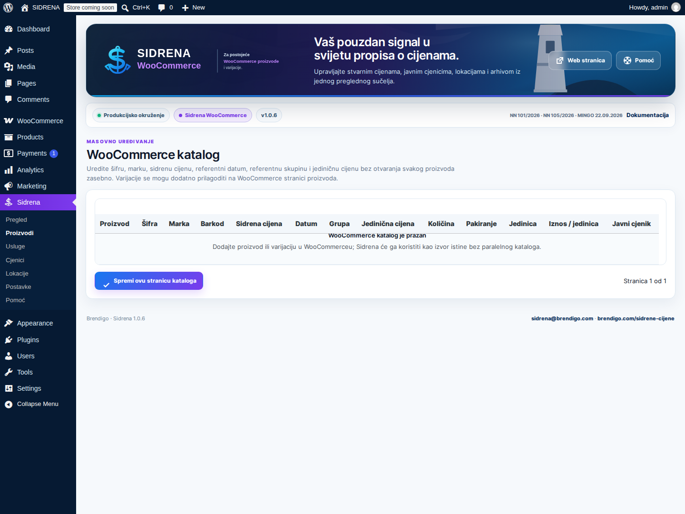
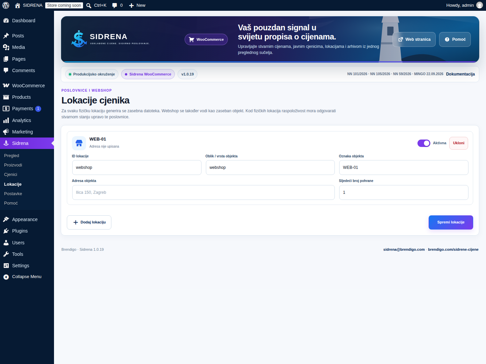

<!--
Sidrena source file.
Author: brendigo
Author URI: https://brendigo.com/
Plugin URI: https://brendigo.com/sidrene-cijene/
Support: sidrena@brendigo.com
-->

# Sidrena WooCommerce - detaljne upute za korištenje

> Screenshot se automatski snima iz aktivnog WordPress + WooCommerce admin sučelja pri pripremi WordPress.org asseta. U instalacijskom ZIP-u nalazi se kao `docs/images/screenshot-admin.png`.

## Galerija stvarnog sučelja

<table>
<tr>
<td width="50%"></td>
<td width="50%"></td>
</tr>
<tr>
<td width="50%"></td>
<td width="50%"></td>
</tr>
<tr>
<td width="50%"></td>
<td width="50%"></td>
</tr>
</table>

Svih šest slika snima se iz aktivnog WordPress + WooCommerce okruženja. Ne koriste se dizajnerski mockupovi kao dokaz stvarnog administratorskog sučelja.

## Vizualni sustav

Sidrena koristi novi produkcijski UI/UX izrađen od nule: tamno plavu navigaciju, lokalni svjetionik vizual, Sidrena S + sidro identitet, responzivne statusne kartice, čiste tablice i jasne akcije. WordPress izdanje koristi plavi akcent, a WooCommerce izdanje uz osnovni Sidrena plavi koristi ljubičasti WooCommerce akcent.

Sve slike u ovoj dokumentaciji dolaze iz stvarnog aktivnog WordPress administratorskog sučelja koje automatski snima CI.

## Namjena

Sidrena WooCommerce namijenjena je WordPress trgovinama s aktivnim WooCommerceom. WooCommerce proizvodi i varijacije ostaju jedini izvor proizvoda - Sidrena ne izrađuje dupli katalog.

## Instalacija

Instalacijski ZIP je namjerno optimiziran za shared hosting: admin CSS/JS i runtime logotipi ostaju obvezan dio paketa, dok WordPress.org screenshotovi i marketinški asseti ostaju izvan ZIP-a. WordPress.org screenshotovi i marketinški asseti nisu u ZIP-u jer nisu potrebni za rad plugina. Build ga ograničava na najviše 1,5 MiB kako bi stao ispod čestog PHP `upload_max_filesize = 2M` limita.

1. Instalirajte i aktivirajte WooCommerce.
2. Prenesite aktualni `sidrena-woocommerce-<verzija>.zip` paket.
3. Aktivirajte **Sidrena WooCommerce**.

Kod nadogradnje preko starijeg SIDRENA WooCommerce izdanja plugin automatski pokreće sigurni repair/migration prolaz i čuva postojeće proizvode, Sidrena meta podatke, lokacije, arhivu i povijest.
4. Otvorite **Sidrena** u lijevom admin meniju.

## Postojeći WooCommerce proizvodi

Nije potrebno ponovno unositi proizvode.

1. Otvorite postojeći WooCommerce proizvod.
2. U Sidrena polja unesite sidrenu cijenu.
3. Odaberite referentnu skupinu ili datum.
4. Dopunite šifru, marku, barkod i podatke za jediničnu cijenu kada nedostaju.
5. Spremite proizvod.

Za varijabilni proizvod podaci se mogu voditi po varijaciji.

## Automatski prikaz sidrene cijene

Kada je sidrena cijena unesena i prikaz uključen, Sidrena je automatski dodaje uz WooCommerce cijenu.

Automatski prikaz pokriva:
- pojedinačni proizvod
- shop i produktne arhive gdje se koristi WooCommerce price HTML
- varijacije
- WooCommerce product-price blokove
- podržane prikaze Elementor, Divi, Bricks, Beaver Builder, Avada/Fusion i druge kompatibilne price elemente

Za posebne rasporede ostaje dostupan shortcode:

`[sidrena_cijena id="123"]`

## Povijest cijena

WooCommerce izdanje prati dostupnu povijest cijena i promjene proizvoda/varijacija. Povijest se ne rekonstruira iz podataka koji ne postoje.

Kod posebnih oblika prodaje 30-dnevna referenca prikazuje se kada plugin ima dovoljno podataka ili kada je unesena provjerena ručna vrijednost.

## WooCommerce CSV

Sidrena polja integrirana su u WooCommerce CSV Import/Export.

Woo sidrena i location CSV import rade row-limit preflight prije obrade. Prevelik upload odbija se prije djelomičnog importa.

## Lokacije

Za fizičke lokacije možete voditi:
- raspoloživost
- cijenu po lokaciji
- sidrenu cijenu po lokaciji

Svaka aktivna lokacija/webshop dobiva odgovarajuću javnu objavu prema konfiguraciji.

## Usluge

Sidrena usluge rade i u WooCommerce izdanju kao zaseban katalog usluga. Prva objava nove usluge finalizira sidrenu vrijednost tek nakon spremanja stvarno unesene aktualne cijene. Shortcode `[sidrena_usluge]` koristi server-side paginaciju. Zadano prikazuje 50 usluga po stranici; atribut `po_stranici` podržava vrijednosti od 10 do 100.

## Objava cjenika na web stranici

U **Sidrena > Cjenici** kliknite **Izradi stranicu Objava cjenika**.

Kompletni javni prikaz koristi shortcode:

\`[sidrena_objava_cjenika]\`

Prikaz je namjerno fokusiran na aktualne cijene, datoteke i arhivu. Opći identitet tvrtke/obrta održava se u odgovarajućem dijelu web-stranice ili WooCommerce postavkama, a ne u Sidrena postavkama.

Javni cjenik koristi server-side pretragu kroz cijeli snapshot i paginaciju. Zadano prikazuje 50 stavki po stranici, a zasebni shortcode može koristiti npr. \`[sidrena_cjenik po_stranici="50"]\`. Podržan raspon je 10–100 stavki po stranici.

Dostupni su i:

- \`[sidrena_cjenici]\` — aktualne datoteke i arhiva
- \`[sidrena_cjenik]\` — pretraživi javni cjenik
- \`[sidrena_arhiva]\` — prethodne objave
- \`[sidrena_cjenik_url]\` — URL aktualne datoteke
- \`[sidrena_usluge]\` — javni katalog usluga

Premium atributi uključuju lokaciju, format (csv/xml), katalog (products/services), prikaz, limit, naslove i uključivanje/isključivanje arhive. Prikaz može biti kartice, popis/list ili tablica/table.

## Pojednostavljene postavke

Sidrena više ne traži da korisnik ručno uključuje zakonski važan output. Automatski ostaju uključeni:

Propis za strojno obradivi cjenik predviđa XML **ili** CSV format. SIDRENA namjerno generira oba formata radi interoperabilnosti i praktičnijeg automatiziranog dohvaćanja; oba formata su tehnička odluka plugina, a ne tvrdnja da zakon zahtijeva oba istodobno.

- CSV i XML
- javni HTML cjenik
- JSON manifest
- REST indeks
- strict publication
- sidrena cijena
- 30-dnevna referentna evidencija
- povijest cijena
- publication watchdog
- upozorenja o neuspjeloj ili zakašnjeloj objavi

U **Sidrena > Postavke** korisnik podešava samo:

1. objavljuje li proizvode, usluge ili oboje
2. vrijeme dnevnog generiranja prije 08:00
3. razdoblje čuvanja arhive, najmanje 30 dana
4. e-mail za upozorenja

Ako je e-mail prazan, koristi se WordPress administratorska adresa. Referentni datumi imaju sigurne zadane vrijednosti; posebna stvarna situacija pojedinog proizvoda ili varijacije rješava se na toj stavci.

## Automatska dnevna objava

Zadano vrijeme generiranja je **06:30**.

Sidrena:
- zakazuje dnevno generiranje
- nakon promjene Sidrena podataka ili relevantne cijene stavlja ponovno generiranje u red
- ima sigurnosnu provjeru današnje objave nakon konfiguriranog vremena
- može poslati ograničeno e-mail upozorenje kod neuspjele ili zakašnjele objave

Za pouzdano izvršavanje prije poslovno kritičnog roka koristite server cron koji redovito pokreće WordPress cron.

## Arhiva

Prethodne uspješne CSV/XML objave ostaju javno dostupne prema postavljenom razdoblju čuvanja, najmanje 30 dana. Javna arhiva grupira datoteke po datumu objave (npr. 24.09.2026.), prikazuje format i naziv datoteke te akciju **Preuzmi**. Aktualne datoteke prikazuju se zasebno i ne dupliciraju se među prethodnim objavama.

## Korak-po-korak za korisnika koji prvi put koristi Sidrena WooCommerce

### Korak 1 — provjerite WooCommerce

WooCommerce mora biti instaliran i aktivan prije Sidrena WooCommerce plugina. Sidrena ne izrađuje drugi katalog proizvoda; koristi postojeće WooCommerce proizvode i varijacije.

### Korak 2 — otvorite Sidrena > Postavke

Za tipičan webshop odaberite **Proizvodi / trgovina**. Ako uz proizvode objavljujete i usluge, odaberite **Proizvodi i usluge**.

Ako nemate poseban razlog za promjenu, ostavite generiranje u 06:30 i arhivu na 45 dana.

### Korak 3 — otvorite Sidrena > Lokacije

Za webshop lokaciju Sidrena može predložiti adresu iz WooCommerce postavki trgovine. Gumb **Popuni Woo adresu webshopa** popunjava samo prazno polje i ništa ne sprema bez vaše potvrde.

Za fizičku poslovnicu unesite stvarnu adresu, oznaku i vrstu objekta.

### Korak 4 — otvorite postojeći WooCommerce proizvod

U Sidrena poljima proizvoda provjerite:

- aktualnu WooCommerce cijenu
- sidrenu cijenu
- referentnu skupinu ili datum
- šifru
- marku
- barkod
- jediničnu cijenu ako je primjenjiva
- podatke o posebnom obliku prodaje ako postoji

Ne unosite izmišljene vrijednosti samo da biste uklonili upozorenje.

### Korak 5 — varijabilni proizvodi

Kod varijabilnog proizvoda provjerite Sidrena podatke po varijaciji.

Na frontendu Sidrena dobiva referentni markup iz WooCommerce variation payloada. U normalnom slučaju promjena varijacije ne radi dodatni REST zahtjev; REST ostaje kompatibilni fallback za teme/builder integracije koje uklone payload.

Ako odabrana varijacija nema referentnu cijenu, Sidrena uklanja stari roditeljski prikaz kako kupac ne bi vidio podatak pogrešne varijacije.

### Korak 6 — koristite bulk editor za veći katalog

Ako imate mnogo proizvoda, koristite Sidrena Woo bulk katalog. Sigurno automatsko popunjavanje radi samo s pouzdanim WooCommerce izvorima i ne prepisuje već unesene vrijednosti.

Nakon masovnog uređivanja pregledajte rezultate prije spremanja.

### Korak 7 — posebni oblici prodaje

Kod sniženja Sidrena prati dostupnu povijest WooCommerce cijena i iz nje pokušava dobiti 30-dnevnu referencu.

Ako povijest nije dovoljna, unesite samo provjerenu ručnu vrijednost iz poslovne evidencije ili stvarno primjenjivu iznimku.

Najniža cijena u prethodnih 30 dana nije isto što i 30-dnevna javna arhiva CSV/XML datoteka.

### Korak 8 — jedinična cijena

Za proizvod označite je li jedinična cijena obvezna, nije primjenjiva ili postoji iznimka. Ako je obvezna, provjerite količinu, jedinicu i izračun.

Sidrena ima standardne konverzije te validirane developer hookove za dodatne jedinice i aliase.

### Korak 9 — lokacijska raspoloživost i cijena

Za fizičke poslovnice globalna WooCommerce zaliha ne mora biti dovoljna. Koristite Sidrena podatke po lokaciji ili CSV predložak lokacija za raspoloživost, lokalnu cijenu i lokalnu sidrenu cijenu.

### Korak 10 — WooCommerce CSV Import/Export

Sidrena polja integrirana su u WooCommerce CSV Import/Export.

Kod većeg uvoza napravite backup i prvo testirajte manju datoteku. Sidrena koristi row-limit preflight i odbija prevelik uvoz prije djelomičnih poslovnih promjena.

### Korak 11 — provjerite Sidrena > Provjera

Riješite stvarna upozorenja: nedostajuću sidrenu cijenu, marku, barkod, jediničnu cijenu, nepotpunu 30-dnevnu referencu, lokacijsku pokrivenost ili problem objave.

Zeleni tehnički status nije pravno jamstvo; potvrđuje da su ugrađene tehničke provjere zadovoljene.

### Korak 12 — generirajte prvi cjenik

U **Sidrena > Cjenici** kliknite **Generiraj cjenik odmah**. Provjerite da su nastale CSV i XML datoteke za odgovarajuću lokaciju i katalog.

### Korak 13 — otvorite javnu Objavu cjenika

Otvorite stranicu kao običan posjetitelj. Provjerite pretragu, cijene, sidrenu cijenu, 30-dnevnu referencu gdje je primjenjiva, download i arhivu.

### Korak 14 — provjerite integritet datoteka

Javni prikaz može koristiti spremljeni broj redaka, veličinu datoteke i SHA-256 checksum bez dodatnog hashiranja pri svakom posjetu.

Ako je datoteka nestala ili je izmijenjena izvan Sidrene, pregledajte Dnevnik i regenerirajte valjanu objavu.

### Korak 15 — cron i upozorenja

WordPress WP-Cron ovisi o prometu. Za pouzdan rok prije 08:00 koristite server cron koji redovito pokreće WordPress cron.

E-mail upozorenje ide na posebno upisanu adresu ili na WordPress administratorski e-mail.

### Korak 16 — nakon ažuriranja WooCommercea, teme ili buildera

Otvorite nekoliko jednostavnih i varijabilnih proizvoda na frontendu, promijenite varijacije i provjerite Sidrena markup. Zatim napravite testno generiranje i provjerite Dnevnik.

## Što ne treba ručno isključivati ili mijenjati

Sidrena automatski drži uključene zakonski važne tehničke izlaze. Nemojte ručno uređivati generirane CSV/XML datoteke, manifest ili arhivske datoteke u uploads/sidrena.

Kod migracije weba zajedno prenesite bazu podataka i cijeli uploads/sidrena sadržaj.

## Produkcijska provjera

- Sidrena prikazuje malu lokalnu sidro ikonicu u WordPress bočnom meniju, bez vanjskih asseta i bez dodatnog dupliciranja brenda.
- Release liniju dodatno čuva Admin polish guard workflow.
- Službeni release smije sadržavati samo `sidrena-wordpress-1.0.22.zip` i `sidrena-woocommerce-1.0.22.zip`.

## WP-CLI

`wp sidrena generate`

`wp sidrena status`

`wp sidrena audit`

WooCommerce izdanje dodatno ima Woo-specifične WP-CLI naredbe kada su registrirane.

## Tehnička kontrola obveznih elemenata

Prije produkcijske objave provjerite najmanje sljedeće:

- dodatna/sidrena cijena uz važeću cijenu kada je obveza primjenjiva
- referentni datum 10.09.2026. za novobuhvaćene proizvode/usluge, odnosno 02.05.2025. za ranije obuhvaćene FMCG kategorije
- CSV ili XML javni cjenik
- zasebnu objavu po lokaciji i webshopu kada je primjenjivo
- najmanje 30 dana javne dostupnosti prethodnih objava
- aktualni cjenik trgovca za tekući radni dan najkasnije do 08:00, odnosno cjenik usluga pri promjeni cijene prema primjenjivom pravilu
- automatizirani dohvat aktualnih maloprodajnih cijena
- obvezna polja proizvoda: naziv, šifra, marka, primjenjiva jedinica i jedinična cijena, maloprodajna cijena, podatak o posebnom obliku prodaje, sidrena cijena, barkod i dostupnost
- za usluge: naziv, maloprodajna cijena, podatak o posebnom obliku prodaje i sidrena cijena, uz podatke o vrsti/opsegu i pripadajućim troškovima gdje ih traži primjenjivi propis

## Sidrena cijena

Sidrena cijena je zasebna referentna vrijednost uz aktualnu WooCommerce cijenu kada je obveza primjenjiva. Ne poistovjećujte je s redovnom WooCommerce cijenom, akcijskom cijenom, najnižom cijenom u prethodnih 30 dana niti s javnom arhivskom datotekom.

SIDRENA može popuniti podatke iz pouzdanih WooCommerce izvora samo gdje je to tehnički i semantički sigurno. Povijesna referentna vrijednost mora odgovarati stvarnoj poslovnoj evidenciji; plugin ne smije izmišljati ili rekonstruirati nedokazivu cijenu.

## Najniža cijena u prethodnih 30 dana

Kod posebnog oblika prodaje SIDRENA koristi dostupnu povijest cijena kao tehničku podlogu za 30-dnevnu referencu. Ako nema dovoljno pouzdanih zapisa, ostavlja potrebu za provjerenim ručnim podatkom umjesto izmišljanja vrijednosti.

WooCommerce sale price i SIDRENA 30-dnevna referenca nisu isti podatak. Također, 30-dnevna referenca nije isto što i najmanje 30 dana javno dostupne arhive digitalnih cjenika.

## Jedinična cijena

Jedinična cijena vodi se po proizvodu ili varijaciji kada je primjenjiva. Kod varijabilnog proizvoda provjerite nasljeđivanje i specifične vrijednosti svake varijacije.

Registry jedinica podržava standardne konverzije i developer hookove `sidrena_unit_definitions` i `sidrena_unit_aliases`. Custom definicije prolaze validaciju canonical keya, baze i multiplikatora. SIDRENA ne određuje pravnu kategoriju samo na temelju WooCommerce kategorije, naziva proizvoda ili taga.

## CSV i XML digitalni cjenici

Službena odluka za strojno obradivi cjenik predviđa XML **ili** CSV format. SIDRENA proizvodi oba formata radi interoperabilnosti, automatizacije i lakše integracije; oba formata nisu predstavljena kao istodobni zakonski minimum.

Za svaki katalog i lokaciju provjerite datum, format, URL, broj redaka, veličinu i SHA-256. Aktualni cjenik i arhiva moraju biti javno dostupni. **Otvori** treba otvoriti javni URL, a **Preuzmi** treba spremiti datoteku.

## Shortcodeovi

Dostupni su `[sidrena_objava_cjenika]`, `[sidrena_cjenik]`, `[sidrena_cjenici]`, `[sidrena_arhiva]`, `[sidrena_cjenik_url]` i `[sidrena_usluge]`.

Atributi poput lokacije, formata, kataloga, arhive, limita, prikaza i naslova validiraju se prije upotrebe. Za frontend birajte kartice, popis ili tablicu, ali ne duplicirajte istu objavu na više mjesta bez potrebe.

## REST, manifest i discovery

SIDRENA REST javni endpointi su read-only i služe javnom dohvaćanju cijena, cjenika i discovery podataka. Administrativni write workflow ne oslanja se na javni REST.

JSON manifest pruža stabilan strojno čitljiv indeks objavljenih datoteka. WooCommerce frontend kompatibilnost može dohvatiti lokalni SIDRENA REST prikaz za odabranu varijaciju; zahtjev ostaje na istoj WordPress stranici i nije telemetrija niti vanjski servis.

## Automatizacija, watchdog i cron

Dnevno generiranje, strict publication, arhiva, povijest, integritet i watchdog trebaju ostati automatski. Korisniku se ne daje jednostavan prekidač kojim može slučajno ugasiti osnovni publication workflow.

WP-Cron ovisi o posjetama stranici. Na produkcijskom webshopu preporučuje se server cron koji redovito pokreće WordPress cron. Nakon promjene server crona napravite testno generiranje i provjerite Dnevnik.

## E-mail upozorenja

Neuspjela objava šalje upozorenje na posebno postavljenu adresu ili WordPress administratorski e-mail. Poruka služi samo operativnom upozorenju; nema marketinšku ili tracking svrhu.

Ako poruke ne stižu, zasebno testirajte WordPress mail/SMTP. Uspješan mail transport ne potvrđuje uspješnu objavu — provjerite i javnu datoteku, manifest i audit rezultat.

## Audit i dnevnik

Audit bilježi ključne radnje i rezultate: generiranje, import, promjene lokacija, integritet, watchdog i greške objave. Kod većeg incidenta izvezite tehničku evidenciju prije čišćenja ili migracije.

Audit nije računovodstveni sustav i ne dokazuje sam po sebi stvarnost povijesne cijene. Služi kao tehnički zapis ponašanja plugina.

## Import i export

WooCommerce izdanje koristi postojeći WooCommerce CSV Import/Export za podržana SIDRENA polja te zasebne SIDRENA alate gdje su potrebni lokacijski ili referentni podaci. Prije importa napravite backup i testirajte uzorak.

Upload prolazi provjeru veličine, ekstenzije i MIME tipa. CSV ima ograničenje redaka i zaštitu od neispravnog/nesigurnog unosa. Podaci se sanitiziraju prije spremanja, a svaka write putanja zahtijeva odgovarajuće ovlasti.

## Varijacije

Varijacije imaju vlastite SIDRENA podatke gdje je to potrebno. Pri spremanju varijacije plugin provjerava WooCommerce nonce, dopuštenje nad nadređenim proizvodom i dopuštenje uređivanja konkretne varijacije.

Frontend hydration koristi odabranu varijaciju, a REST fallback ograničen je na javni read-only prikaz. Nakon promjene strukture varijacija obavezno testirajte barem jedan jednostavni i jedan varijabilni proizvod.

## Bulk editor

Bulk editor je namijenjen sigurnom masovnom uređivanju postojećih WooCommerce proizvoda. Spremanje zahtijeva SIDRENA capability, nonce i `edit_post` dopuštenje za svaki pojedini proizvod; redovi za koje korisnik nema ovlast preskaču se.

Kod velikog kataloga radite u manjim serijama i nakon spremanja otvorite **Provjera**. Bulk editor ne smije zaobići WooCommerce katalog niti stvarati paralelne kopije proizvoda.

## Lokacijske cijene i raspoloživost

Fizička lokacija ima vlastitu cijenu, sidrenu cijenu i raspoloživost samo kada postoje stvarni lokacijski podaci. Globalni WooCommerce stock ne koristi se kao lažna lokalna raspoloživost.

WooCommerce adresa trgovine može se ponuditi kao početni prijedlog lokacije, ali se ne sprema automatski bez korisnikove radnje. Kod više poslovnica provjerite svaku lokaciju odvojeno.

## Troubleshooting

Ako SIDRENA polja nisu vidljiva na proizvodu, provjerite je li aktivno WooCommerce izdanje i je li WooCommerce aktivan. Ako spremanje ne uspije, provjerite korisničke ovlasti i eventualni security/cache plugin koji blokira admin request.

Ako frontend ne osvježava podatak kod promjene varijacije, ispraznite cache/minification sloj i provjerite lokalni REST endpoint. Ako cjenik ne nastane, otvorite **Provjera** i **Dnevnik**, zatim ručno pokrenite generiranje.

Kod lokacijskih podataka provjerite ID lokacije, pripadni proizvod/varijaciju i raspoloživost. Nemojte popunjavati fizičku lokaciju globalnim stockom samo da uklonite upozorenje.

## Update postupak

Prije nadogradnje napravite backup baze i `uploads/sidrena`. Nakon nadogradnje provjerite WooCommerce status, otvorite nekoliko proizvoda i varijacija, zatim napravite ručnu objavu i frontend test.

Nakon veće WooCommerce nadogradnje provjerite HPOS/kompatibilnost, CSV import/export i variation hydration. Ne aktivirajte samostalno WordPress izdanje paralelno s WooCommerce izdanjem.

## Sigurnost

Administrativne write akcije koriste nonce i capability provjere. Spremanje proizvoda i varijacija dodatno poštuje WooCommerce nonce i `edit_post` prava nad konkretnim objektom. Importi imaju ograničenja veličine/redaka, MIME provjeru i sanitizaciju.

Nema telemetrije, skrivenog trackinga ni vanjskog update servisa. Lokalni frontend zahtjevi idu na vlastiti WordPress REST endpoint. Vanjske poveznice za dokumentaciju/podršku otvaraju se tek kada ih korisnik klikne.

## Pravna napomena

SIDRENA je tehnički alat i nije pravna potvrda poslovanja. Korisnik je odgovoran za stvarne WooCommerce cijene, povijesne podatke, primjenjivost propisa, posebne iznimke, lokacijsku stvarnost i pravodobnu objavu. Zeleni tehnički status znači da su ugrađene provjere prošle, a ne da WordPress.org ili brendigo jamče pravnu usklađenost.

## Podrška

- E-mail: **info@brendigo.com**
- Dokumentacija: `docs/SIDRENA-UPUTE.pdf`
- Web-stranica projekta: **https://brendigo.com/sidrene-cijene/**
- Autor: **brendigo**

## Donacija

Donacija nije potrebna za korištenje SIDRENA funkcija. Plugin ne sadrži donacijski link niti donacija otključava funkcije, podršku ili pravnu potvrdu.

## Licenca

Sidrena se distribuira pod licencom **GPLv2 ili novijom**, u skladu sa zahtjevima WordPress.org direktorija. Autorski i projektni identitet Brendiga ne smije se lažno predstavljati.

Puni tekst licence nalazi se u datoteci `LICENSE`.

## Prije produkcijske objave

Provjerite:
- stvarne WooCommerce cijene
- sidrene/referentne cijene i datume
- podatke za jediničnu cijenu
- raspoloživost po lokacijama
- automatski prikaz uz proizvod
- javni HTML prikaz
- CSV/XML datoteke
- arhivu
- Pomoć → Dnevnik

Sidrena tehnički podržava provjerene zahtjeve za podatke i objavu cjenika, ali softver sam po sebi nije pravna potvrda poslovanja. Povijesne i referentne cijene moraju odgovarati stvarnoj poslovnoj evidenciji, a korisnik mora provjeriti primjenjivost važećih obveza na svoje konkretne proizvode, usluge i prodajna mjesta.

## Uvoz velikih kataloga

Sidrena provjerava maksimalan broj redaka prije poslovnih promjena. CSV/XML import podržava najviše 50.000 zapisa po datoteci. CSV obrađuje se streaming pristupom, a XML koristi XMLReader kada je dostupan uz NONET i zabranu DOCTYPE/ENTITY deklaracija. Prevelika datoteka odbija se prije djelomičnog unosa.
