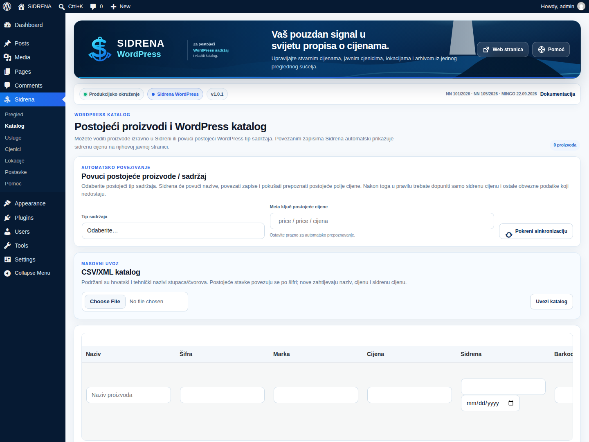
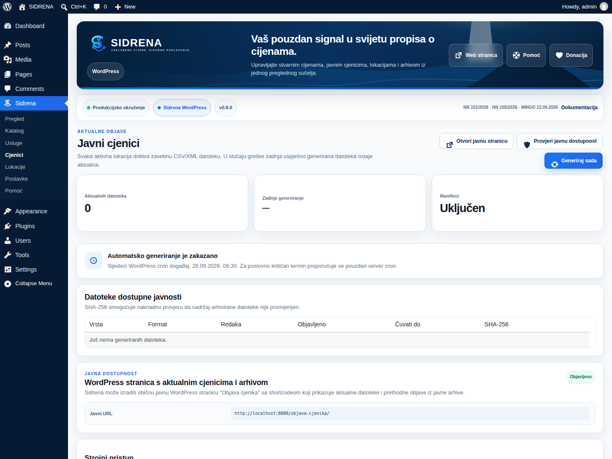
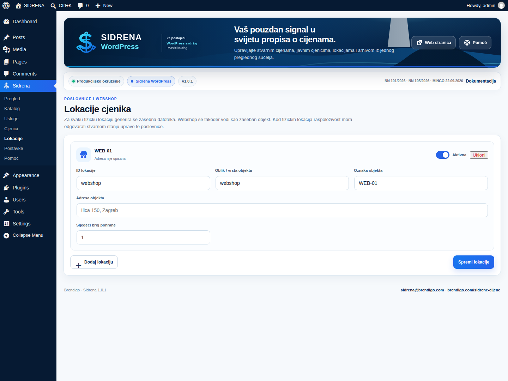

<!--
Sidrena source file.
Author: Brendigo
Author URI: https://brendigo.com/
Plugin URI: https://brendigo.com/sidrene-cijene/
Support: sidrena@brendigo.com
-->

# Sidrena WordPress 0.9.0 - Upute za korištenje

> Screenshot se automatski snima iz aktivnog WordPress admin sučelja pri pripremi WordPress.org asseta. U instalacijskom ZIP-u nalazi se kao `docs/images/screenshot-admin.png`.

## Galerija stvarnog sučelja

<table>
<tr>
<td width="50%"></td>
<td width="50%"></td>
</tr>
<tr>
<td width="50%"></td>
<td width="50%"></td>
</tr>
</table>

Sve četiri slike snimaju se iz aktivnog plugina. Ne koriste se dizajnerski mockupovi kao dokaz stvarnog administratorskog sučelja.

## Vizualni sustav 0.9.0

Sidrena 0.9.0 koristi novi produkcijski UI/UX izrađen od nule: tamno plavu navigaciju, lokalni svjetionik vizual, Sidrena S + sidro identitet, responzivne statusne kartice, čiste tablice i jasne akcije. WordPress izdanje koristi plavi akcent, a WooCommerce izdanje uz osnovni Sidrena plavi koristi ljubičasti WooCommerce akcent.

Sve slike u ovoj dokumentaciji dolaze iz stvarnog aktivnog WordPress administratorskog sučelja koje automatski snima CI.

## Namjena

Sidrena WordPress namijenjena je WordPress web stranicama koje **ne koriste WooCommerce kao izvor proizvoda**. Proizvode možete voditi u Sidrena katalogu ili povezati s postojećim javnim WordPress sadržajem.

## Instalacija

1. Prenesite `sidrena-wordpress-0.9.0.zip` u WordPress > Dodaci > Dodaj novi > Prenesi dodatak.
2. Aktivirajte **Sidrena WordPress**.
3. Otvorite **Sidrena** u lijevom admin meniju.
4. Otvorite **Sidrena > Katalog**.

## Najbrži način za postojeću web stranicu

Ako na stranici već imate proizvode ili drugi tip sadržaja koji predstavlja proizvode:

1. U **Sidrena > Katalog** otvorite karticu za automatsko povezivanje.
2. Odaberite postojeći javni tip sadržaja.
3. Ako znate meta ključ cijene, unesite ga; inače polje ostavite prazno.
4. Kliknite **Pokreni sinkronizaciju**.
5. Sidrena obrađuje zapise u batchovima od 100.
6. Nakon povezivanja provjerite naziv i aktualnu cijenu.
7. Dopunite **sidrenu cijenu**, datum, marku, barkod i jediničnu cijenu kada su primjenjivi.

Sidrena pokušava prepoznati uobičajene meta ključeve cijene kao što su `_price`, `price`, `cijena`, `product_price`, `_regular_price` i `regular_price`.

## Automatski prikaz sidrene cijene

Povezanom WordPress zapisu Sidrena automatski dodaje sidrenu cijenu na javnoj pojedinačnoj stranici. Nije potrebno ručno umetati shortcode za svaki povezani proizvod.

Za posebne rasporede i page buildere možete koristiti:

`[sidrena_cijena id="s123"]`

gdje je `123` ID Sidrena proizvoda.

## Ručni katalog

Ako ne želite povezivati postojeći sadržaj, proizvode možete:
- dodati ručno u Sidrena katalog
- uvesti CSV/XML datotekom
- uređivati u tabličnom prikazu

## Uvoz velikih kataloga

Sidrena 0.9.0 provjerava maksimalan broj redaka prije poslovnih promjena. CSV/XML import podržava najviše 50.000 zapisa po datoteci. WordPress CSV obrađuje se streaming pristupom, a XML koristi XMLReader kada je dostupan uz NONET i zabranu DOCTYPE/ENTITY deklaracija. Prevelika datoteka odbija se prije djelomičnog unosa.

## Usluge

Usluge se vode zasebno i mogu se prikazivati na javnom cjeniku zajedno s proizvodima ili kao poseban cjenik usluga. Shortcode `[sidrena_usluge]` koristi server-side paginaciju. Zadano prikazuje 50 usluga po stranici; atribut `po_stranici` podržava vrijednosti od 10 do 100.

## Lokacije

Za svaku aktivnu lokaciju/webshop Sidrena generira zasebnu objavu prema konfiguraciji. Provjerite:
- oznaku
- vrstu objekta
- adresu
- aktivnost lokacije
- redni broj objave

## Objava cjenika na web stranici

U **Sidrena > Cjenici** kliknite **Izradi stranicu Objava cjenika**.

Plugin objavljuje WordPress stranicu sa shortcodeom:

`[sidrena_objava_cjenika]`

Kompletni shortcode prikazuje podatke obrta/tvrtke (ako su uključeni), aktualni pretraživi cjenik te datoteke za preuzimanje i arhivu.

Javni cjenik u 0.9.0 koristi server-side pretragu kroz cijeli snapshot i paginaciju. Zadano se prikazuje 50 stavki po stranici, a zasebni shortcode može koristiti npr. `[sidrena_cjenik po_stranici="50"]`. Podržan raspon je 10–100 stavki po stranici. Pretraga i paginacija rade bez JavaScripta.

Dostupni su i zasebni prikazi:

`[sidrena_cjenici]` — samo aktualne datoteke i arhiva preuzimanja

`[sidrena_cjenik]`

`[sidrena_arhiva]`

`[sidrena_usluge]`

## Podaci obrta / tvrtke

U **Sidrena > Postavke** možete unijeti naziv, sjedište/adresu, OIB, poslovni e-mail, telefon, naziv i broj javnog registra, PDV identifikacijski broj te nadležno/nadzorno tijelo kada je primjenjivo.

Ta se polja mogu prikazati na stranici **Objava cjenika**, ali nisu dodani stupci propisanog CSV/XML cjenika proizvoda/usluga.

Ako unesete OIB, Sidrena provjerava njegovu kontrolnu znamenku.

## Automatska dnevna objava

Zadano vrijeme generiranja je **06:30**.

Sidrena:
- zakazuje dnevno generiranje
- nakon spremanja bitnih podataka stavlja ponovno generiranje u red
- ima sigurnosnu provjeru koja nakon planiranog vremena provjerava postoji li današnja objava i po potrebi pokreće novu generaciju
- može poslati ograničeno e-mail upozorenje kod neuspjele ili zakašnjele objave

WordPress WP-Cron ovisi o izvršavanju WordPressa. Za pouzdano izvršavanje prije poslovno kritičnog roka konfigurirajte server cron koji redovito pokreće WordPress cron.

## Arhiva

Prethodne uspješne CSV/XML objave ostaju javno dostupne prema postavljenom razdoblju čuvanja, najmanje 30 dana. U 0.9.0 javna arhiva grupira datoteke po datumu objave (npr. 24.09.2026.), prikazuje format i naziv datoteke te akciju **Preuzmi**. Aktualne datoteke prikazuju se zasebno i ne dupliciraju se među prethodnim objavama.

## Produkcijsko poliranje 0.9.0

- Sidrena prikazuje malu lokalnu sidro ikonicu u WordPress bočnom meniju, bez vanjskih asseta i bez dodatnog dupliciranja brenda.
- Release liniju dodatno čuva Admin polish guard workflow.
- Službeni release smije sadržavati samo `sidrena-wordpress-0.9.0.zip` i `sidrena-woocommerce-0.9.0.zip`.

## WP-CLI

`wp sidrena generate`

`wp sidrena status`

`wp sidrena audit`

## Tehnička kontrola obveznih elemenata

Prije produkcijske objave provjerite najmanje sljedeće:

- dodatna/sidrena cijena uz važeću cijenu kada je obveza primjenjiva
- referentni datum 10.09.2026. za novobuhvaćene proizvode/usluge, odnosno 02.05.2025. za ranije obuhvaćene FMCG kategorije
- CSV ili XML javni cjenik
- zasebnu objavu po lokaciji i webshopu kada je primjenjivo
- najmanje 30 dana javne dostupnosti prethodnih objava
- aktualni cjenik trgovca za tekući radni dan najkasnije do 08:00, odnosno cjenik usluga pri promjeni cijene prema primjenjivom pravilu
- automatizirani dohvat aktualnih maloprodajnih cijena
- obvezna polja proizvoda: naziv, šifra, marka, primjenjiva jedinica i jedinična cijena, maloprodajna cijena, podatak o posebnom obliku prodaje, sidrena cijena, barkod i dostupnost
- za usluge: naziv, maloprodajna cijena, podatak o posebnom obliku prodaje i sidrena cijena, uz podatke o vrsti/opsegu i pripadajućim troškovima gdje ih traži primjenjivi propis

## Podrška

- E-mail: **sidrena@brendigo.com**
- WhatsApp: **+385 91 901 0092**
- Plugin možete instalirati i postaviti sami.
- Opcionalno jednokratno postavljanje od strane Brendiga: **80 EUR jednokratno**.
- PDF: `docs/SIDRENA-PODRSKA.pdf`
- Autor: **Brendigo**

## Donacija

Donacija za razvoj je **dobrovoljna** i otvara se izravno preko Revoluta.

## Licenca

Sidrena se distribuira pod licencom **GPLv2 ili novijom**, u skladu sa zahtjevima WordPress.org direktorija. Autorski i projektni identitet Brendiga ne smije se lažno predstavljati.

Puni tekst licence nalazi se u datoteci `LICENSE`.

## Prije produkcijske objave

Provjerite:
- stvarnu aktualnu cijenu
- stvarnu sidrenu/referentnu cijenu i datum
- marku, šifru i barkod
- jediničnu cijenu kada je primjenjiva
- dostupnost
- javni HTML prikaz
- CSV/XML datoteke
- arhivu
- Pomoć → Dnevnik

Sidrena tehnički podržava provjerene zahtjeve za podatke i objavu cjenika, ali softver sam po sebi nije pravna potvrda poslovanja. Povijesne i referentne cijene moraju odgovarati stvarnoj poslovnoj evidenciji, a korisnik mora provjeriti primjenjivost važećih obveza na svoje konkretne proizvode, usluge i prodajna mjesta.
