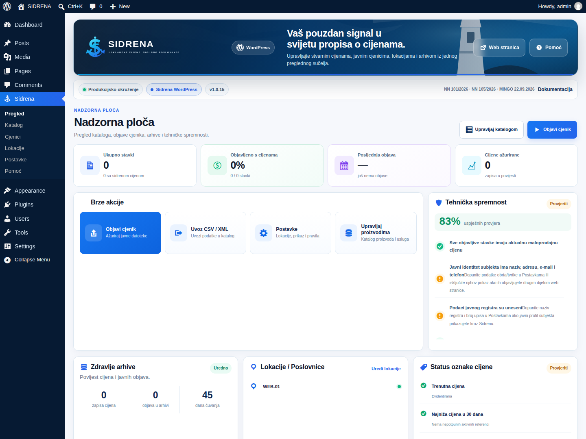
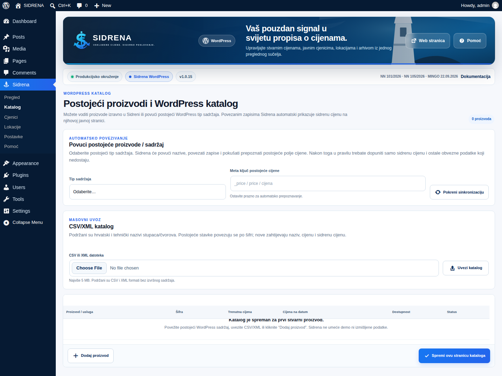
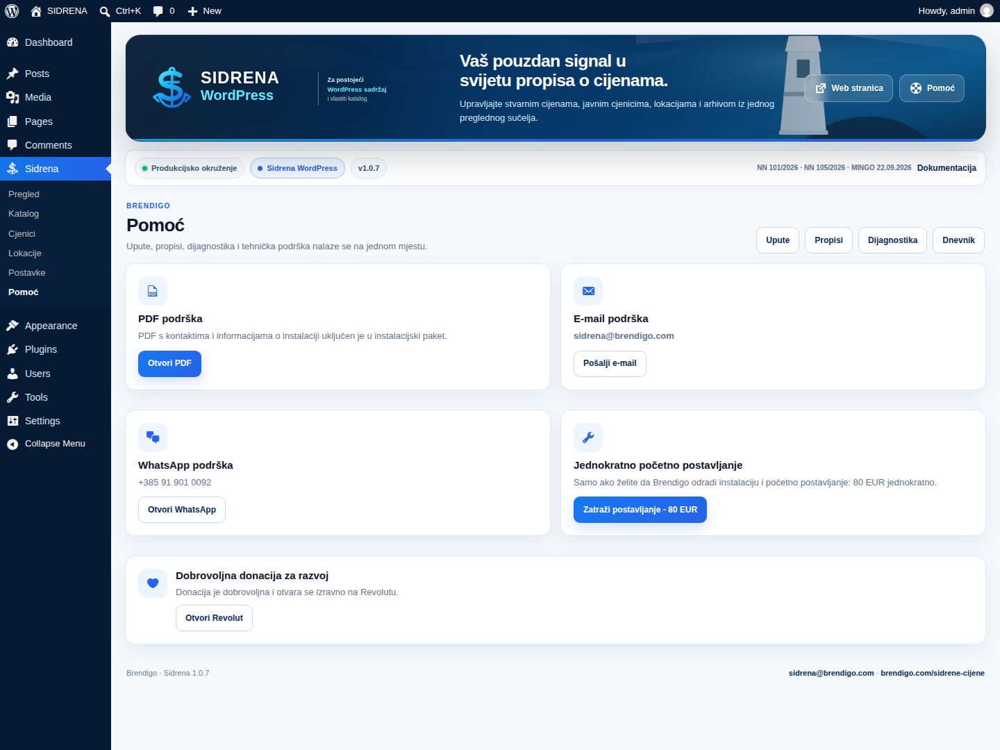

<!--
Sidrena source file.
Author: Brendigo
Author URI: https://brendigo.com/
Plugin URI: https://brendigo.com/sidrene-cijene/
Support: sidrena@brendigo.com
-->

# Sidrena WordPress - detaljne upute za korištenje

> Screenshot se automatski snima iz aktivnog WordPress admin sučelja pri pripremi WordPress.org asseta. U instalacijskom ZIP-u nalazi se kao `docs/images/screenshot-admin.png`.

## Galerija stvarnog sučelja

<table>
<tr>
<td width="50%"></td>
<td width="50%"></td>
</tr>
<tr>
<td width="50%"></td>
<td width="50%"></td>
</tr>
<tr>
<td width="50%"></td>
<td width="50%"></td>
</tr>
</table>

Svih šest slika snima se iz aktivnog plugina. Ne koriste se dizajnerski mockupovi kao dokaz stvarnog administratorskog sučelja.

## Vizualni sustav

Sidrena koristi novi produkcijski UI/UX izrađen od nule: tamno plavu navigaciju, lokalni svjetionik vizual, Sidrena S + sidro identitet, responzivne statusne kartice, čiste tablice i jasne akcije. WordPress izdanje koristi plavi akcent, a WooCommerce izdanje uz osnovni Sidrena plavi koristi ljubičasti WooCommerce akcent.

Sve slike u ovoj dokumentaciji dolaze iz stvarnog aktivnog WordPress administratorskog sučelja koje automatski snima CI.

## Namjena

Sidrena WordPress namijenjena je WordPress web stranicama koje **ne koriste WooCommerce kao izvor proizvoda**. Proizvode možete voditi u Sidrena katalogu ili povezati s postojećim javnim WordPress sadržajem.

## Instalacija

Instalacijski ZIP 1.0.21 je namjerno optimiziran za shared hosting: admin CSS/JS i runtime logotipi ostaju obvezan dio paketa, dok WordPress.org screenshotovi i marketinški asseti ostaju izvan ZIP-a. WordPress.org screenshotovi i marketinški asseti nisu u ZIP-u jer nisu potrebni za rad plugina. Build ga ograničava na najviše 1,5 MiB kako bi stao ispod čestog PHP `upload_max_filesize = 2M` limita.

1. Prenesite `sidrena-wordpress-1.0.21.zip` u WordPress > Dodaci > Dodaj novi > Prenesi dodatak.
2. Aktivirajte **Sidrena WordPress**.
3. Otvorite **Sidrena** u lijevom admin meniju.
4. Otvorite **Sidrena > Katalog**.

Kod nadogradnje preko starijeg SIDRENA WordPress izdanja plugin automatski pokreće sigurni repair/migration prolaz i čuva postojeće kataloge, postavke, arhivu i povijest.

## Najbrži način za postojeću web stranicu

Ako na stranici već imate proizvode ili drugi tip sadržaja koji predstavlja proizvode:

1. U **Sidrena > Katalog** otvorite karticu za automatsko povezivanje.
2. Odaberite postojeći javni tip sadržaja.
3. Ako znate meta ključ cijene, unesite ga; inače polje ostavite prazno.
4. Kliknite **Pokreni sinkronizaciju**.
5. Sidrena obrađuje zapise u batchovima od 100.
6. Nakon povezivanja provjerite naziv i aktualnu cijenu.
7. Dopunite **sidrenu cijenu**, datum, marku, barkod i jediničnu cijenu kada su primjenjivi.

Sidrena pokušava prepoznati uobičajene meta ključeve cijene kao što su `_price`, `price`, `cijena`, `product_price`, `_regular_price` i `regular_price`.

## Automatski prikaz sidrene cijene

Povezanom WordPress zapisu Sidrena automatski dodaje sidrenu cijenu na javnoj pojedinačnoj stranici. Nije potrebno ručno umetati shortcode za svaki povezani proizvod.

Za posebne rasporede i page buildere možete koristiti:

`[sidrena_cijena id="s123"]`

gdje je `123` ID Sidrena proizvoda.

## Ručni katalog

Ako ne želite povezivati postojeći sadržaj, proizvode možete:
- dodati ručno u Sidrena katalog
- uvesti CSV/XML datotekom
- uređivati u tabličnom prikazu

## Uvoz velikih kataloga

Sidrena provjerava maksimalan broj redaka prije poslovnih promjena. CSV/XML import podržava najviše 50.000 zapisa po datoteci. WordPress CSV obrađuje se streaming pristupom, a XML koristi XMLReader kada je dostupan uz NONET i zabranu DOCTYPE/ENTITY deklaracija. Prevelika datoteka odbija se prije djelomičnog unosa.

## Usluge

Usluge se vode zasebno i mogu se prikazivati na javnom cjeniku zajedno s proizvodima ili kao poseban cjenik usluga. Prva objava nove usluge finalizira sidrenu vrijednost tek nakon spremanja stvarno unesene aktualne cijene. Shortcode `[sidrena_usluge]` koristi server-side paginaciju. Zadano prikazuje 50 usluga po stranici; atribut `po_stranici` podržava vrijednosti od 10 do 100.

## Lokacije

Za svaku aktivnu lokaciju/webshop Sidrena generira zasebnu objavu prema konfiguraciji. Provjerite:
- oznaku
- vrstu objekta
- adresu
- aktivnost lokacije
- redni broj objave

## Objava cjenika na web stranici

U **Sidrena > Cjenici** kliknite **Izradi stranicu Objava cjenika**.

Plugin objavljuje WordPress stranicu sa shortcodeom [sidrena_objava_cjenika]. Prikaz je namjerno fokusiran na cijene, datoteke i arhivu; opći identitet tvrtke/obrta održava se u odgovarajućem dijelu web-stranice, a ne u Sidrena postavkama.

Javni cjenik koristi server-side pretragu kroz cijeli snapshot i paginaciju. Zadano se prikazuje 50 stavki po stranici, a zasebni shortcode može koristiti npr. [sidrena_cjenik po_stranici="50"]. Podržan raspon je 10–100 stavki po stranici. Pretraga i paginacija rade bez JavaScripta.

Dostupni su i zasebni prikazi:

- [sidrena_cjenici] — aktualne datoteke i arhiva
- [sidrena_cjenik] — pretraživi javni cjenik
- [sidrena_arhiva] — prethodne objave
- [sidrena_cjenik_url] — URL aktualne datoteke
- [sidrena_usluge] — javni katalog usluga

Premium atributi za datoteke/arhivu uključuju lokacija, format (csv/xml), katalog (products/services), arhiva, limit, prikaz i naslovi. Prikaz može biti kartice, popis/list ili tablica/table.

## Pojednostavljene postavke

Sidrena više ne traži da laik odlučuje treba li uključiti zakonski važan output. Automatski su uključeni CSV, XML, javni HTML cjenik, JSON manifest, REST indeks, strict publication, sidrena cijena, 30-dnevna referentna evidencija, povijest cijena i upozorenja.

U **Sidrena > Postavke** korisnik podešava samo:

1. objavljuje li proizvode, usluge ili oboje
2. vrijeme dnevnog generiranja prije 08:00
3. razdoblje čuvanja arhive, najmanje 30 dana
4. e-mail za upozorenja

Ako je e-mail prazan, koristi se WordPress administratorska adresa. CSV koristi stabilni razdjelnik, a referentni datumi imaju zakonski zadane vrijednosti; posebna stvarna situacija pojedinog proizvoda rješava se na proizvodu.

## Automatska dnevna objava

Zadano vrijeme generiranja je **06:30**.

Sidrena:
- zakazuje dnevno generiranje
- nakon spremanja bitnih podataka stavlja ponovno generiranje u red
- ima sigurnosnu provjeru koja nakon planiranog vremena provjerava postoji li današnja objava i po potrebi pokreće novu generaciju
- može poslati ograničeno e-mail upozorenje kod neuspjele ili zakašnjele objave

WordPress WP-Cron ovisi o izvršavanju WordPressa. Za pouzdano izvršavanje prije poslovno kritičnog roka konfigurirajte server cron koji redovito pokreće WordPress cron.

## Arhiva

Prethodne uspješne CSV/XML objave ostaju javno dostupne prema postavljenom razdoblju čuvanja, najmanje 30 dana. Javna arhiva grupira datoteke po datumu objave (npr. 24.09.2026.), prikazuje format i naziv datoteke te akciju **Preuzmi**. Aktualne datoteke prikazuju se zasebno i ne dupliciraju se među prethodnim objavama.

## Korak-po-korak za korisnika koji prvi put koristi Sidrenu

### Korak 1 — otvorite Postavke

Odaberite način rada. Za običnu trgovinu odaberite **Proizvodi / trgovina**. Ako imate samo usluge odaberite **Usluge**. Ako imate oboje, odaberite **Proizvodi i usluge**.

Ostavite vrijeme 06:30 ako nemate poseban razlog za drugačije vrijeme. Sidrena neće prihvatiti rizično vrijeme 08:00 ili kasnije.

### Korak 2 — uredite Lokacije

Otvorite **Sidrena > Lokacije**. Svaka aktivna lokacija mora imati jasan ID, vrstu objekta, oznaku i stvarnu adresu. Adresa ulazi i u naziv datoteke, zato izbjegavajte privremene ili testne vrijednosti.

### Korak 3 — unesite prvi proizvod

Otvorite **Sidrena > Katalog** i unesite stvarni proizvod. Za početni test preporučuje se jedan proizvod s potpuno popunjenim podacima prije masovnog uvoza.

Provjerite naziv, šifru, marku, barkod, aktualnu cijenu, sidrenu cijenu, dostupnost te jedinicu/jediničnu cijenu ako je primjenjiva.

### Korak 4 — provjerite sidrenu cijenu

Sidrena cijena mora dolaziti iz stvarne evidencije. Ne unosite izmišljenu vrijednost samo da biste uklonili upozorenje.

Za opće novobuhvaćene stavke zadani referentni datum je 10.09.2026., a za ranije obuhvaćene FMCG kategorije 02.05.2025. Posebni slučajevi evidentiraju se na stavci.

### Korak 5 — ako postoji sniženje, provjerite 30-dnevnu referencu

Najniža cijena u prethodnih 30 dana i javna arhiva od 30 dana nisu ista stvar. Sidrena ih vodi odvojeno.

Kod posebnog oblika prodaje provjerite da postoji dokaziva 30-dnevna referenca ili stvarno primjenjiva iznimka.

### Korak 6 — provjerite jediničnu cijenu

Za proizvod označite je li jedinična cijena obvezna, nije primjenjiva ili postoji iznimka. Ako je obvezna, unesite količinu i jedinicu te provjerite izračun.

### Korak 7 — otvorite Provjeru

Otvorite **Sidrena > Provjera** i redom riješite crvena/žuta upozorenja. Zeleni status znači da je tehnička provjera prošla, ne da plugin daje pravno jamstvo.

### Korak 8 — generirajte prvi cjenik

U **Sidrena > Cjenici** kliknite **Generiraj cjenik odmah**. Nakon završetka provjerite da postoje CSV i XML datoteke.

### Korak 9 — otvorite javnu stranicu

Izradite stranicu **Objava cjenika** i otvorite je kao običan posjetitelj. Isprobajte pretragu, paginaciju i preuzimanje.

### Korak 10 — provjerite arhivu i integritet

Nakon više uspješnih objava starije datoteke ulaze u arhivu. Sidrena prikazuje veličinu, broj redaka i SHA-256 podatak koji je spremljen pri generiranju.

### Korak 11 — provjerite e-mail upozorenja i cron

Provjerite da WordPress administratorski e-mail ili posebno upisana adresa može primati poruke. Ako hosting ima slab WP-Cron, postavite server cron.

### Korak 12 — nakon svake veće promjene

Nakon uvoza, promjene lokacija ili velikog uređivanja kataloga otvorite Dnevnik i napravite ručnu probnu generaciju.

## Što ne treba dirati ručno

Nemojte ručno brisati datoteke u uploads/sidrena, mijenjati manifest ili uređivati arhivske CSV/XML datoteke nakon objave. Ako morate migrirati web, prenesite cijeli uploads/sidrena sadržaj i bazu podataka zajedno.

## Produkcijska provjera

- Sidrena prikazuje malu lokalnu sidro ikonicu u WordPress bočnom meniju, bez vanjskih asseta i bez dodatnog dupliciranja brenda.
- Release liniju dodatno čuva Admin polish guard workflow.
- Službeni release smije sadržavati samo `sidrena-wordpress-1.0.21.zip` i `sidrena-woocommerce-1.0.21.zip`.

## WP-CLI

`wp sidrena generate`

`wp sidrena status`

`wp sidrena audit`

## Tehnička kontrola obveznih elemenata

Prije produkcijske objave provjerite najmanje sljedeće:

- dodatna/sidrena cijena uz važeću cijenu kada je obveza primjenjiva
- referentni datum 10.09.2026. za novobuhvaćene proizvode/usluge, odnosno 02.05.2025. za ranije obuhvaćene FMCG kategorije
- CSV ili XML javni cjenik
- zasebnu objavu po lokaciji i webshopu kada je primjenjivo
- najmanje 30 dana javne dostupnosti prethodnih objava
- aktualni cjenik trgovca za tekući radni dan najkasnije do 08:00, odnosno cjenik usluga pri promjeni cijene prema primjenjivom pravilu
- automatizirani dohvat aktualnih maloprodajnih cijena
- obvezna polja proizvoda: naziv, šifra, marka, primjenjiva jedinica i jedinična cijena, maloprodajna cijena, podatak o posebnom obliku prodaje, sidrena cijena, barkod i dostupnost
- za usluge: naziv, maloprodajna cijena, podatak o posebnom obliku prodaje i sidrena cijena, uz podatke o vrsti/opsegu i pripadajućim troškovima gdje ih traži primjenjivi propis

## Podrška

- E-mail: **sidrena@brendigo.com**
- WhatsApp: **+385 91 901 0092**
- Plugin možete instalirati i postaviti sami.
- Opcionalno jednokratno postavljanje od strane Brendiga: **80 EUR jednokratno**.
- PDF: `docs/SIDRENA-PODRSKA.pdf`
- Autor: **Brendigo**

## Donacija

Donacija za razvoj je **dobrovoljna** i otvara se izravno preko Revoluta.

## Licenca

Sidrena se distribuira pod licencom **GPLv2 ili novijom**, u skladu sa zahtjevima WordPress.org direktorija. Autorski i projektni identitet Brendiga ne smije se lažno predstavljati.

Puni tekst licence nalazi se u datoteci `LICENSE`.

## Prije produkcijske objave

Provjerite:
- stvarnu aktualnu cijenu
- stvarnu sidrenu/referentnu cijenu i datum
- marku, šifru i barkod
- jediničnu cijenu kada je primjenjiva
- dostupnost
- javni HTML prikaz
- CSV/XML datoteke
- arhivu
- Pomoć → Dnevnik

Sidrena tehnički podržava provjerene zahtjeve za podatke i objavu cjenika, ali softver sam po sebi nije pravna potvrda poslovanja. Povijesne i referentne cijene moraju odgovarati stvarnoj poslovnoj evidenciji, a korisnik mora provjeriti primjenjivost važećih obveza na svoje konkretne proizvode, usluge i prodajna mjesta.
